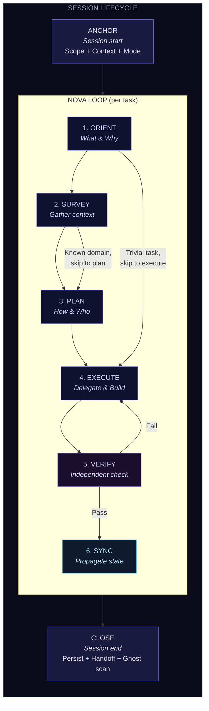
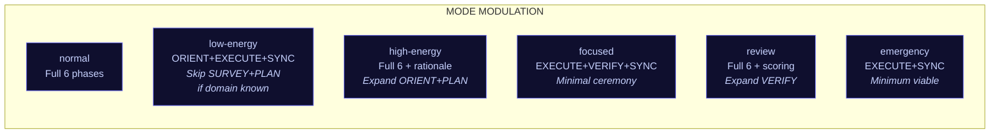
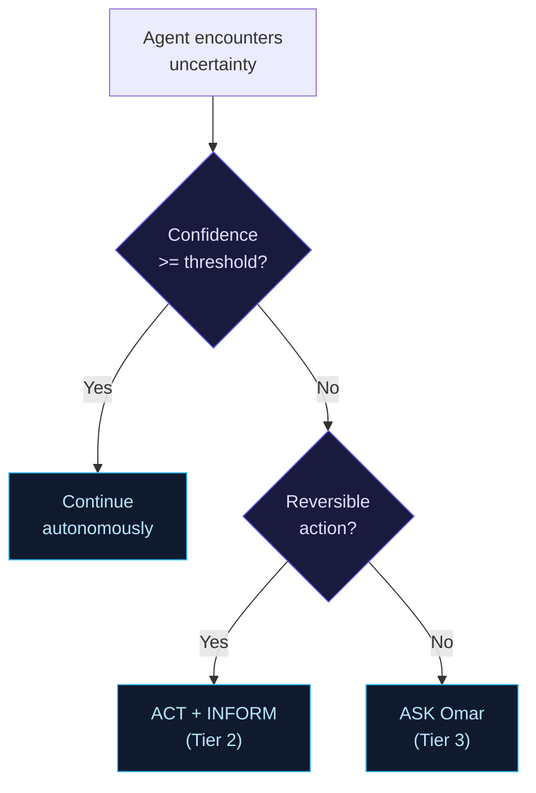

# Core Workflow Design Proposal — "Agentic Loop"

**Version**: 0.1 (proposal)
**Date**: 2026-02-23
**Author**: Architect Agent (Claude Opus 4.6)
**Status**: AWAITING OMAR'S REVIEW
**Scope**: Universal operational workflow for all Omar + Nova work across all CLIs and domains

---

## Table of Contents

1. [Proposed Name and Rationale](#1-proposed-name-and-rationale)
2. [Architecture Overview](#2-architecture-overview)
3. [Phase Diagram](#3-phase-diagram)
4. [Phase Details](#4-phase-details)
5. [Cross-Cutting Engines](#5-cross-cutting-engines)
6. [Guard-Rail Inventory](#6-guard-rail-inventory)
7. [Comparison Table](#7-comparison-table)
8. [Domain Examples](#8-domain-examples)
9. [Migration Plan](#9-migration-plan)
10. [Risk Assessment](#10-risk-assessment)

---

## 1. Proposed Name and Rationale

### Option A: **Agentic Loop** (Recommended)

- Identity-bound: Nova is the partnership identity. The loop IS the partnership.
- Memorable: Two syllables. Everyone (Omar, agents, docs) refers to the same thing.
- Extensible: "Agentic Loop v2" works. "Agentic Loop: Emergency" works as a mode variant.
- Not generic: Avoids "Core Workflow" (16 things already claim this name) or "Operational Loop" (sounds like DevOps).

### Option B: Core Loop

- Pro: Simple, no branding. Con: Already used by 3 different workflows (Original Core Loop, Kael Core Loop, Unified Guide). Too overloaded.

### Option C: DRIVE Loop (Discover-Route-Implement-Verify-Emit)

- Pro: Acronym maps to phases. Con: Forced naming (phases named to fit the acronym rather than describe the action).

**Recommendation**: Agentic Loop. It is ours. It encodes identity. It is unique.

---

## 2. Architecture Overview

The Agentic Loop is a **PDCA shell** (Plan-Do-Check-Act as the outer structure) with an **OODA inner loop** (Observe-Orient-Decide-Act for rapid iteration within execution phases) and an **Evaluator gate** (Producer != Verifier as a structural invariant).

### Design Principles

1. **6 phases, not 5** -- SYNC is the critical missing phase (the #1 gap from research). It is a first-class citizen, not an afterthought.
2. **Session bookends** -- ANCHOR (session start) and CLOSE (session end) are structural events, not phases. They bracket the loop.
3. **Mode modulation** -- Every phase has a mode variant. The base workflow is the "normal" mode. Other modes compress, expand, or skip phases.
4. **Delegation-native** -- The orchestrator's actions are explicitly listed per phase. Everything else is delegated.
5. **Engines, not phases** -- The Thinking Cycle and Agent Lifecycle are cross-cutting engines invoked WITHIN phases, not competing workflows.
6. **Guard-rails attach to phases** -- Every guard-rail has a home phase where it activates.

### Architectural Formula

```
Agentic Loop = PDCA(shell) + OODA(inner) + Evaluator(gate) + Mode(modulator) + SYNC(propagator)
```

Where:
- **PDCA** provides the audit trail and quality gates (ORIENT=Plan, EXECUTE=Do, VERIFY=Check, SYNC=Act)
- **OODA** provides rapid iteration within EXECUTE (ReAct thought-action-observation cycles)
- **Evaluator** enforces Producer != Verifier at the VERIFY gate
- **Mode** modulates ceremony, autonomy, and information density at every phase
- **SYNC** propagates state changes to all impacted files (the VT Mandatory Workflow's unique contribution, now universalized)

---

## 3. Phase Diagram



### Mode Modulation Overlay



### Confidence Gate (within phases)



---

## 4. Phase Details

### SESSION BOOKEND: ANCHOR

**Purpose**: Establish session scope, load context, set mode -- creating the Focus Anchor that all drift detection measures against.

**Actions** (orchestrator does these directly):

| Step | Action | Source |
|------|--------|--------|
| 1 | Read mode from `manifest.json` / `current-mode.json` | Mode System |
| 2 | Read relevant handoff (`ops/handoff/` or `~/omar/inbox/`) | Kael RECEIVE |
| 3 | Read work-overview.md for current priorities | VT Mandatory |
| 4 | Declare or confirm session scope | Focus Guardian |
| 5 | Confirm: "Session scope: [X]. Mode: [Y]. Proceeding." | Original Core Loop |

**Exit Criteria**: Scope declared. Mode set. Context loaded.

**Mode Modulation**:

| Mode | ANCHOR Behavior |
|------|----------------|
| normal | Full 5-step ANCHOR. Confirm scope with Omar. |
| low-energy | Read handoff + mode. Propose scope. "Session scope: [X]. Launching." |
| high-energy | Full ANCHOR + share reasoning on scope choice. Discuss priorities. |
| focused | 1-line scope from context. "Continuing [X]." No discussion. |
| review | Full ANCHOR + enumerate what's pending review. Wait for Omar's pick. |
| emergency | Skip ANCHOR. Infer scope from Omar's message. Act immediately. |

**Anti-patterns**:
- Starting work without declaring scope (drift becomes undetectable)
- Reading 10+ files at ANCHOR (context burn before work even starts)
- Asking Omar "What do you want to work on?" when work-overview has clear P0/P1

**Guard-rails**: CONTEXT BURN (max 3 file reads at ANCHOR), WARM-UP TRAP (first task is not special)

---

### PHASE 1: ORIENT

**Purpose**: Understand WHAT is being asked and WHY it matters -- before touching anything.

**Actions**:

| Step | Action | Who |
|------|--------|-----|
| 1 | Parse Omar's intent (explicit + implicit) | Orchestrator |
| 2 | Map to work type (Development / Research / Operations / Business / Creative) | Orchestrator |
| 3 | Identify 2-3 approaches, recommend 1 | Orchestrator |
| 4 | Surface decisions requiring Omar's judgment NOW | Orchestrator |

**Exit Criteria**: Omar validates direction (or orchestrator proceeds per autonomy tier).

**Mode Modulation**:

| Mode | ORIENT Behavior |
|------|----------------|
| normal | 2-3 approaches, recommend 1. Wait for Omar's "go". |
| low-energy | 1 recommendation only. "Doing [X] because [Y]. Starting." |
| high-energy | All viable approaches with scored matrix. Discuss trade-offs. |
| focused | Infer from context. 1-liner: "Interpreting as [X]. Executing." |
| review | All approaches with weighted scoring. Wait for explicit approval. |
| emergency | Skip ORIENT. Best approach. Execute. |

**Anti-patterns**:
- Jumping to execution without understanding WHY (tunnel vision)
- Asking 5 questions at once (question tax)
- Presenting a menu without a recommendation (decision burden on Omar)
- Researching during ORIENT (that is SURVEY's job)

**Guard-rails**: QUESTION TAX (only ask when genuinely ambiguous), NO DEEP THINKING (use sequential-thinking for non-trivial framing)

**Delegation**: ORIENT is orchestrator-level. It requires judgment about intent and approach. Do not delegate.

**Thinking Cycle mapping**: Frame phase of Thinking Cycle fires here for non-trivial problems.

**Skip conditions**: Trivial task (typo fix, obvious next step) -> skip to EXECUTE. Known continuation from handoff -> skip to PLAN or EXECUTE.

---

### PHASE 2: SURVEY

**Purpose**: Gather context -- know what exists before building.

**Actions**:

| Step | Action | Who |
|------|--------|-----|
| 1 | Check prior work (`knowledge/research/`, `ops/decisions/`) | Orchestrator (lightweight scan) or sub-agent (deep audit) |
| 2 | Audit current state of relevant files/code/configs | Sub-agent (delegated) |
| 3 | Identify constraints, dependencies, blockers | Orchestrator (synthesizes agent findings) |
| 4 | Persist findings to knowledge directory | Sub-agent |

**Exit Criteria**: Enough context to plan. Findings persisted (not just in chat).

**Mode Modulation**:

| Mode | SURVEY Behavior |
|------|----------------|
| normal | Delegate to researcher agent. Review summary. |
| low-energy | Skip if domain is known. Otherwise: 1 quick scan, no deep audit. |
| high-energy | Full research + share findings. Discuss before planning. |
| focused | Skip if domain known. Minimal scan otherwise. |
| review | Full survey. All findings presented before planning. |
| emergency | Skip entirely. Act on available context. |

**Anti-patterns**:
- Research rabbit holes (timebox to 5-10 min for standard tasks)
- Researching only in chat (lost at compaction -- findings MUST go to files)
- Orchestrator reading 200+ lines directly (delegate to sub-agent per 200r threshold)
- Re-researching what already exists in `knowledge/`

**Guard-rails**: CONTEXT BURN (delegate heavy reading), MEMORY BRIEF (read reference files before briefing agents)

**Delegation**: Almost always delegated. Orchestrator reviews findings (1 Read to verify), does not conduct the survey.

**Thinking Cycle mapping**: Research phase fires here.

**Skip conditions**: Known domain where prior work is fresh and accessible -> skip to PLAN.

---

### PHASE 3: PLAN

**Purpose**: Define HOW the work will be done, WHO does each part, and WHAT "done" looks like -- before executing anything.

**Actions**:

| Step | Action | Who |
|------|--------|-----|
| 1 | Define "done" criteria (TDD: define done before starting) | Orchestrator |
| 2 | Decompose into tasks (2-5 min each for dev work) | Orchestrator or planning agent |
| 3 | Assign: solo (orchestrator) / sub-agent / team / external CLI | Orchestrator |
| 4 | Surface ALL decisions requiring Omar's input before execution | Orchestrator |
| 5 | Produce plan artifact (for complex work) | Orchestrator or agent to file |

**Exit Criteria**: Omar approves plan (or orchestrator proceeds per autonomy tier). Every task has: what to do, who does it, expected outcome, verification method.

**Mode Modulation**:

| Mode | PLAN Behavior |
|------|-------------|
| normal | Plan -> approve -> execute. Quality > speed. |
| low-energy | Lightweight plan. Internal only. Speed ~= quality. |
| high-energy | Full plan + rationale. Share reasoning. Co-define done with Omar. |
| focused | Plan silently. Execute. Speed + quality. |
| review | Detailed plan for approval. Quality >> speed. Wait for explicit go. |
| emergency | No plan. Act on best judgment. Document after. |

**Anti-patterns**:
- Plans only in chat (lost at compaction)
- Vague tasks ("implement auth" instead of "add JWT middleware to /api/auth")
- No expected outcomes (untestable tasks)
- Orchestrator doing detailed planning for 50+ line tasks (delegate to planning agent)
- Launching execution agents in parallel with planning agents (planning depends on survey, execution depends on plan -- respect the DAG)

**Guard-rails**: PLAN FIRST (no execution without a plan, except trivial tasks), NO TASK GRAPH (complex work needs dependency wiring), PHASE GATE (Omar must approve before advancing)

**Delegation**: Orchestrator owns the plan structure. For complex plans: delegate to planning agent, review output.

**Delegation Decision Tree** (from Agent Lifecycle):

```
Single focused task?
  YES -> Quick (<2 min)? -> Do inline : Sub-agent
  NO  -> Tasks independent? -> Parallel sub-agents : Dependent? -> Sequential chain : Team
```

**Hard rule**: >200 lines to read OR >100 lines to write = sub-agent. No exceptions.

**Thinking Cycle mapping**: Evaluate + Ground phases fire here for non-trivial problems (score approaches, confront with reality).

**Skip conditions**: Trivial task where the plan IS the task (e.g., "fix the typo in line 42").

---

### PHASE 4: EXECUTE

**Purpose**: Build it. The orchestrator delegates and monitors. Sub-agents execute in their own context windows.

**Actions**:

| Step | Action | Who |
|------|--------|-----|
| 1 | Brief sub-agents (Goal, Context, Scope, Output, Constraints, References) | Orchestrator |
| 2 | Include safety block in every agent prompt | Orchestrator |
| 3 | Launch agents (parallel when independent, sequential when dependent) | Orchestrator |
| 4 | Monitor: check for blockers, confidence-gate escalations | Orchestrator |
| 5 | Collect results (agent writes to file, reports path + summary) | Orchestrator (1 Read per agent to verify) |

**Exit Criteria**: All planned tasks completed. Agent output in files (not chat). Ready for verification.

**Mode Modulation**:

| Mode | EXECUTE Behavior |
|------|-----------------|
| normal | Delegate >200r/100w. Track all tasks. |
| low-energy | Delegate aggressively. Coarse tracking. |
| high-energy | Fine-grained tracking. Share agent progress with Omar. |
| focused | Silent agents. Minimal tracking. Maximum ACT autonomy. |
| review | Standard tracking. Keep decisions at orchestrator level. |
| emergency | Maximum ACT. Skip optional steps. Speed >> quality. |

**Anti-patterns**:
- Orchestrator writing code directly (DELEGATION CHECK)
- Orchestrator reading 200+ lines (CONTEXT BURN)
- "Just one quick edit" x 5 = bulk work that should have been 1 sub-agent (BATCHING RULE)
- Briefing agents from memory instead of reference files (MEMORY BRIEF)
- Using general-purpose agent when a specialist exists (AGENT SELECTION PROTOCOL)

**Guard-rails**: DELEGATION CHECK (before every tool call), SOLO CODING (>50 lines = agent), CONTEXT BURN (>50% window used), TOOL MISMATCH (deterministic tasks = scripts, not agents), BULK OPS (>3 files = agent)

**Delegation**: EXECUTE is almost entirely delegated. The orchestrator's job is to brief, launch, monitor, collect. The orchestrator NEVER produces the work product.

**Mandatory Safety Block** (include in every agent prompt):

```
SAFETY -- MANDATORY, NON-NEGOTIABLE:
- Read every file before modifying it
- Verify every file after modifying it
- For moves: confirm content at destination BEFORE removing source
- For deletes: confirm content preserved elsewhere FIRST
- If unsure about ANY operation: STOP and report back. Do NOT guess.
- ZERO data loss tolerance. When in doubt, preserve.
```

**Agent Lifecycle mapping**: The full 9-phase Agent Lifecycle (Trigger -> Decide -> Brief -> Launch -> Monitor -> Collect -> Verify -> Dissolve -> Integrate) executes within this phase.

---

### PHASE 5: VERIFY

**Purpose**: Independently confirm that the work meets the "done" criteria defined in PLAN. The producer is NEVER the verifier.

**Actions**:

| Step | Action | Who |
|------|--------|-----|
| 1 | **Stage 1 -- Spec Compliance**: Did the work match the plan? Anything missing? Anything extra? | Verification agent (Haiku for mechanical diff, Sonnet for judgment) |
| 2 | **Stage 2 -- Quality**: Is the output accurate, well-structured, integrated? Red flags? | Verification agent or Omar |
| 3 | Compare key facts against source data (not agent self-report) | Verification agent |
| 4 | Surface gaps as structured summary (not full output) | Orchestrator |

**Exit Criteria**:
- PASS: Both stages clear. Advance to SYNC.
- FAIL: Issues found. Loop back to EXECUTE with specific fix instructions.

**Mode Modulation**:

| Mode | VERIFY Behavior |
|------|----------------|
| normal | Two-stage review. Delegate to verification agent. Report to Omar at milestones. |
| low-energy | Quick verify. End of batch only. Auto-proceed if no red flags. |
| high-energy | Full two-stage + discuss findings with Omar. After each step. |
| focused | Zero mid-work checkpoints. Summary at end. |
| review | Full two-stage after each decision. Wait for Omar's approval. Weighted scoring. |
| emergency | Skip if reversible. Ship, then verify. |

**Anti-patterns**:
- Self-verification (producer = verifier -- systematically biased)
- Skipping because "tests pass" (tests cover code, not intent)
- Reviewing only the last commit (must verify against full plan scope)
- Trusting agent's self-reported "success" without reading the file

**Guard-rails**: PRODUCER != VERIFIER (separate agent or human), NO EVIDENCE (no "done" without proof), COMPLETION INTEGRITY (all N requirements met, not "most")

**Delegation**: ALWAYS delegated (verification agent) unless the task is trivial enough that a single Read suffices. For high-stakes: Omar occupies the Evaluator role.

**Thinking Cycle mapping**: Ground + Re-evaluate phases fire here (confronting theory with reality, deciding whether to loop back).

---

### PHASE 6: SYNC

**Purpose**: Propagate all state changes to every impacted file, persist knowledge, update tracking systems, and commit. This is the anti-drift phase.

**Actions**:

| Step | Action | Who |
|------|--------|-----|
| 1 | **Impact Scan**: "What files are impacted by this change?" | Orchestrator (judgment) |
| 2 | **Cascade Update**: Update all impacted files (use the SYNC Checklist) | Sub-agent (delegated for >3 files) |
| 3 | **Knowledge Persist**: Extract decisions, learnings, knowledge to canonical locations | Orchestrator (routes) + sub-agent (writes) |
| 4 | **Task Update**: Update work-overview.md, Linear (if applicable), TASKS.md | Orchestrator or linear-agent |
| 5 | **Commit**: Run `make changelog`, then `git commit` | Orchestrator (Tier 1 ACT) |

**SYNC Checklist** (universal, extends VT-specific version):

| If you changed... | Also update... |
|---|---|
| A decision was made/resolved | Decision records, conflict registries, status dashboards |
| Data files (any domain) | Status/truth files, reconciliation logs |
| A conflict was resolved | Conflict registry, status dashboards |
| Repository structure | STRUCTURE.md (`make structure-update`), AGENTS.md if top-level |
| A rule or governance file | All references to that rule, CLAUDE.md/AGENTS.md if impacted |
| Knowledge was gained | `knowledge/research/` or skill file or mcp-memory-service |
| A task was completed | work-overview.md, Linear issue, TASKS.md |
| A handoff is needed | Handoff file, status dashboard |

**Exit Criteria**: All impacted files updated. Grep for old values confirms zero remaining occurrences. Commit successful.

**Mode Modulation**:

| Mode | SYNC Behavior |
|------|-------------|
| normal | Full SYNC checklist. Commit proactively. |
| low-energy | Minimal sync (task update + commit). Deep cascade deferred. |
| high-energy | Full SYNC + explain what was updated and why. |
| focused | Auto-sync. Silent commit. Zero discussion. |
| review | Full SYNC. Enumerate all updates for Omar's review before commit. |
| emergency | Skip optional syncs. Commit the essentials. Log what was skipped for next session. |

**Anti-patterns**:
- Skipping SYNC ("the task is done, why bother?") -- this is how data drift happens
- Partial cascade (updating the primary file but not cross-references)
- Committing without `make changelog`
- Pushing without asking (pushing = Tier 3 ASK)
- Forgetting to update work-overview.md

**Guard-rails**: CASCADE UPDATE (grep old value + related keywords), TASKS.md DELAY (update immediately, not later), GHOST ITEM DETECTION (scan for untracked work)

**Delegation**: Impact Scan is orchestrator judgment. Actual updates are delegated if >3 files.

---

### SESSION BOOKEND: CLOSE

**Purpose**: Ensure the next session (or next agent instance) can resume without archaeology.

**Actions**:

| Step | Action | Who |
|------|--------|-----|
| 1 | **Ghost Scan**: Check for untracked work items in conversation | Orchestrator |
| 2 | **Handoff**: Write/update handoff file with: what was done, what remains, blockers | Sub-agent (delegated) |
| 3 | **Persist**: Store durable learnings to mcp-memory-service | Orchestrator |
| 4 | **Mirror** (Focus Guardian): "SESSION REVIEW: [N] drifts, pattern: [X], cost: [Y] messages." | Orchestrator |
| 5 | **Next priorities**: Surface top 2-3 priorities from work-overview.md | Orchestrator |

**Exit Criteria**: Handoff file exists. No ghost items. Next session can start from ANCHOR without guesswork.

**Mode Modulation**:

| Mode | CLOSE Behavior |
|------|---------------|
| normal | Full 5-step CLOSE. |
| low-energy | Steps 1-3 only. Skip Mirror. Brief handoff. |
| high-energy | Full CLOSE + retrospective ("what went well, what didn't"). |
| focused | Minimal: handoff + ghost scan. No discussion. |
| review | Full CLOSE + session quality assessment. |
| emergency | Skip CLOSE. Log "CLOSE skipped -- emergency" in handoff. |

**Anti-patterns**:
- Ending a session without a handoff (next session starts with archaeology)
- Orchestrator writing the full handoff directly (delegate to sub-agent)
- Skipping ghost scan (untracked work = lost work)

---

## 5. Cross-Cutting Engines

These are NOT phases. They are cognitive or operational engines invoked WITHIN phases as needed.

### 5.1 Thinking Cycle (Cognitive Engine)

**Source**: `~/omar/intent/workflow/thinking-cycle.md`

**Invocation**: Any phase where the problem is non-trivial. The Thinking Cycle provides the internal reasoning process.

| Agentic Loop Phase | Thinking Cycle Phase(s) Used |
|---|---|
| ORIENT | Frame |
| SURVEY | Research |
| PLAN | Evaluate + Ground |
| EXECUTE | Ground (does execution match plan?) |
| VERIFY | Ground + Re-evaluate |

**Rule**: Mandatory scoring (0-10) when the Thinking Cycle is invoked. No gut feelings.

### 5.2 Agent Lifecycle (Delegation Engine)

**Source**: `~/omar/intent/workflow/agent-lifecycle-pattern.md`

**Invocation**: Within EXECUTE (and sometimes VERIFY) whenever sub-agents are spawned.

| Agent Lifecycle Phase | Agentic Loop Context |
|---|---|
| Trigger | Task identified in PLAN |
| Decide | Delegation Decision Tree (solo/sub-agent/team) |
| Brief | Structured brief with safety block |
| Launch | Agent spawned |
| Monitor | Orchestrator checks for blockers |
| Collect | Agent reports path + summary |
| Verify | Feeds into Agentic Loop VERIFY phase |
| Dissolve | Agent context released |
| Integrate | Feeds into Agentic Loop SYNC phase |

### 5.3 Focus Guardian (Drift Engine)

**Source**: `~/.claude/rules/rules.md` section Focus Guardian Protocol

**Invocation**: Continuous -- active at ALL phases. Measures every action against the Focus Anchor declared at ANCHOR.

| Signal | Level | Intervention |
|---|---|---|
| Topic switch | NUDGE | "Captured to [destination]. Back to [session scope]." |
| Scope expansion | NUDGE | "Captured to [destination]. Back to [session scope]." |
| Rabbit hole (3rd tangent follow-up) | FLAG | "Second tangent this session. [Topic] captured. Complete [current task]." |
| Complexity spiral | FLAG | "Adding layers to simple problem. Returning to [task]." |
| Analysis paralysis | BLOCK | "FOCUS CHECK: [X] messages on [tangent]. Parking. Returning to [task]." |

### 5.4 Confidence Gate (Escalation Engine)

**Invocation**: Any point during any phase where the agent encounters uncertainty.

Three escalation triggers (from external research):
1. **Confidence threshold breach** -- uncertainty exceeds acceptable level
2. **Scope boundary encounter** -- task touches something outside declared scope
3. **Structural failure** -- tool failure, API error, system unavailable

Escalation package (mandatory):
- What the agent was trying to accomplish (goal)
- What it has done so far (progress)
- What it needs from Omar (specific ask)
- Why it cannot proceed alone (blocker)
- What the default action would be (recommendation)

---

## 6. Guard-Rail Inventory

Every guard-rail has a HOME PHASE where it primarily activates, plus phases where it may also fire.

| Guard-Rail | Home Phase | Also Active In | Trigger | Action |
|---|---|---|---|---|
| **SCOPE ANCHOR** | ANCHOR | All | No session scope declared | STOP. Declare scope before proceeding. |
| **CONTEXT BURN** | EXECUTE | ANCHOR, SURVEY | >50% context window on single task | STOP. Delegate or handoff. |
| **DELEGATION CHECK** | EXECUTE | All | About to execute ANY work | STOP. Ask: "Can a sub-agent do this?" |
| **QUESTION TAX** | ORIENT | All | About to ask Omar a trivial question | STOP. If obviously "yes" -> DO IT + notify. |
| **PLAN FIRST** | PLAN | -- | Complex work starting without a plan | STOP. Plan before executing. |
| **PHASE GATE** | All transitions | -- | Advancing to next phase without approval | STOP. Wait for explicit approval (mode-dependent). |
| **PRODUCER != VERIFIER** | VERIFY | -- | Same agent verifying its own output | STOP. Spawn separate verification agent. |
| **CASCADE UPDATE** | SYNC | -- | Data edited but cross-references not checked | STOP. Grep old value + related keywords. |
| **GHOST DETECTION** | CLOSE | SYNC | Untracked work items in conversation | STOP. Add to TASKS.md immediately. |
| **FOCUS DRIFT** | All | -- | Drift signal detected (see Focus Guardian) | NUDGE/FLAG/BLOCK per graduated intervention. |
| **MEMORY BRIEF** | EXECUTE | -- | About to brief agent from memory | STOP. Read reference files first. |
| **TOOL MISMATCH** | EXECUTE | -- | Using agents for deterministic tasks | STOP. Use scripts/code instead. |
| **WALL OF TEXT** | All | -- | About to output >30 lines in chat | STOP. Write to file, link it. |
| **NO EVIDENCE** | VERIFY | SYNC | Claiming "done" without proof | STOP. Provide proof first. |
| **ZERO LOSS** | EXECUTE | SYNC | About to modify/move/delete without safety net | STOP. Create safety net first. |
| **COMPLETION INTEGRITY** | VERIFY | -- | Marking done when not ALL requirements met | STOP. Verify against original scope. |

### Human-in-the-Loop Gate Types

Three standardized gate types (replacing the ad-hoc "wait for Omar" patterns across workflows):

| Gate Type | Omar's Action | When Used |
|---|---|---|
| **ACKNOWLEDGE** | Omar sees the output. No explicit approval needed. | After SURVEY (in normal mode), after SYNC. |
| **APPROVE** | Omar says "go" or equivalent. Work stops until approval. | After ORIENT (approaches), after PLAN (plan file). |
| **DECIDE** | Omar chooses from presented options. | After ORIENT (when multiple viable approaches), any time 131 pattern triggers. |

Gate activation varies by mode:

| Mode | ORIENT Gate | PLAN Gate | VERIFY Gate |
|------|-------------|-----------|-------------|
| normal | APPROVE | APPROVE | ACKNOWLEDGE |
| low-energy | -- (auto) | -- (auto) | -- (auto, end of batch) |
| high-energy | APPROVE | APPROVE | APPROVE |
| focused | -- (auto) | -- (auto) | -- (auto, summary at end) |
| review | DECIDE | APPROVE | APPROVE |
| emergency | -- (auto) | -- (auto) | -- (auto) |

---

## 7. Comparison Table

| Dimension | Original Core Loop (WF-01, archived) | VT Mandatory Workflow (WF-02, current) | Unified Guide (WF-04, current) | **Agentic Loop (proposed)** |
|---|---|---|---|---|
| **Phases** | 6 (French names) | 6 (SCOUT-REPORT-QUESTIONS-ACTION-SYNC-COMMIT) | 5 (Frame-Research-Plan-Execute-Verify) | **6 phases + 2 bookends** (ORIENT-SURVEY-PLAN-EXECUTE-VERIFY-SYNC + ANCHOR/CLOSE) |
| **Session lifecycle** | None | None | None | **ANCHOR + CLOSE bookends** (scope declaration, handoff, ghost detection) |
| **SYNC / state propagation** | None | YES (unique contribution, with checklist) | None (biggest gap) | **YES, universalized** (extends VT checklist to all domains) |
| **Mode-awareness** | None | None | None | **Full mode modulation** (every phase adapts per 6 modes) |
| **Delegation model** | Implicit | Implicit | Decision tree in Execute | **Delegation-native** (orchestrator actions explicit per phase, everything else delegated) |
| **Verification model** | VERIFIER phase (self-verify OK) | None explicit | Two-stage review | **Producer != Verifier** (mandatory separate agent, model-tiered) |
| **Focus/drift prevention** | None | None | None | **Focus Guardian** (structural, continuous, graduated intervention) |
| **Confidence gate** | 94% threshold (hard) | None | None | **Confidence Gate engine** (3 triggers, escalation package, mode-adjusted threshold) |
| **Guard-rails** | 1 (confidence) | 1 (SYNC checklist) | 3 (gates, 200r/100w, phase skip) | **17 named guard-rails** (attached to specific phases) |
| **Cross-session continuity** | None | None | None | **CLOSE bookend** (handoff, ghost scan, mirror, next priorities) |
| **Thinking Cycle integration** | None | None | Referenced but not mapped | **Mapped to phases** (Frame->ORIENT, Research->SURVEY, etc.) |
| **Agent Lifecycle integration** | None | None | Decision tree only | **Full 9-phase lifecycle** within EXECUTE |
| **Work types covered** | VT operations | VT operations | All 5 types | **All 5 types** (inherits Unified Guide mapping) |
| **CLI portability** | Claude only (VT) | Claude only (VT) | Claude-centric | **Universal** (Claude, Gemini, Kilo, Codex) |
| **Phase skipping** | None | None | Per work type | **Mode + work type** (dual-axis skip logic) |
| **Scope**: VT-only vs universal | VT-only | VT-only | Universal | **Universal** |

### What Each Predecessor Contributed

| Predecessor | Unique Contribution Preserved in Agentic Loop |
|---|---|
| Original Core Loop (WF-01) | 94% confidence threshold concept -> Confidence Gate engine |
| VT Mandatory (WF-02) | SYNC phase with checklist -> SYNC as Phase 6 |
| Kael Core Loop (WF-03) | RECEIVE/DELEGATION CHECK/GHOST DETECTION/HANDOFF -> ANCHOR + guard-rails + CLOSE |
| Unified Guide (WF-04) | 5-phase structure + work type mapping -> base skeleton |
| Thinking Cycle (WF-05) | 6-phase cognitive engine -> cross-cutting engine |
| Dev Workflow (WF-06) | TDD cycle + phase skip guide -> EXECUTE inner loop + skip logic |
| Agent Lifecycle (WF-07) | 9-phase agent management -> delegation engine |
| ERV (WF-08) | Phased execution with dependency chains -> PLAN decomposition |
| Workspace Playbook (WF-09) | Protect-first, snapshot-verify -> SYNC verification pattern |
| VT Reservation (WF-11, archived) | REPEAT BACK / parse pattern -> ORIENT structured parsing |
| OTA Capture (WF-14) | Data quality flags, DRY routing -> SYNC cascade checklist |

---

## 8. Domain Examples

### Example 1: Hotel Booking Fix (Operations)

**Context**: A guest reports their booking dates are wrong on HotelRunner. Omar asks Nova to fix it.

| Phase | What Happens |
|---|---|
| **ANCHOR** | Mode: normal. Scope: "Fix booking date discrepancy for guest [X]." |
| **ORIENT** | Parse Omar's message. Work type: Operations. Approach: check booking data, compare with HotelRunner, fix discrepancy. No alternatives needed -- straightforward fix. |
| **SURVEY** | Sub-agent reads `data/bookings/reservations/` for the guest. Browser agent checks HotelRunner. Report: "Booking shows Jan 15-18, HotelRunner shows Jan 15-17. Discrepancy: checkout date." |
| **PLAN** | Fix plan: (1) Update HotelRunner checkout to Jan 18, (2) Verify propagation to Booking.com, (3) Update local booking data. "Done" = all three systems show Jan 15-18. |
| **EXECUTE** | Browser agent updates HotelRunner. Wait 15 min for propagation. Browser agent checks Booking.com. Sub-agent updates `data/bookings/reservations/[guest].md`. |
| **VERIFY** | Verification agent: reads all 3 locations (HotelRunner, Booking.com, local data). Confirms all show Jan 15-18. PASS. |
| **SYNC** | Update reconciliation log. Update ops/status/truth.md if booking data section exists. Commit. |

**Mode Variants**: In emergency mode, SURVEY and PLAN collapse -- go straight to EXECUTE with the obvious fix. In review mode, Omar sees the plan and approves before any platform changes.

---

### Example 2: Code Feature (Development)

**Context**: Omar wants to add a validation script that checks all room profiles against the template.

| Phase | What Happens |
|---|---|
| **ANCHOR** | Mode: normal. Scope: "Build room profile validation script." |
| **ORIENT** | Work type: Development. Approaches: (A) Python script with pytest, (B) Bash script with regex, (C) JSON Schema validation. Recommend A: Python + pytest aligns with existing `scripts/` and `tests/` patterns. Omar: "Go." |
| **SURVEY** | Sub-agent audits: `context/meta/templates/room-profile-template.md` (the schema), `data/rooms/R01-R12/profile.md` (12 instances), `scripts/audit/` (existing audit patterns). Findings: template has 15 fields, profiles use markdown format, existing scripts use `uv run`. Persisted to `knowledge/research/development/room-validation-audit.md`. |
| **PLAN** | Plan file: `scripts/audit/validate_room_profiles.py`. Tasks: (1) Parse template into field list, (2) Parse each profile, (3) Compare fields, (4) Report missing/extra/mismatched fields. TDD: test with known-good R01 and a deliberately broken test fixture. "Done" = all 12 profiles pass, test suite passes, script integrated into Makefile. |
| **EXECUTE** | Sub-agent with `superpowers:test-driven-development` skill: RED (write failing test) -> GREEN (implement parser) -> REFACTOR (clean up). Agent writes to `scripts/audit/validate_room_profiles.py` and `tests/test_room_validation.py`. Reports: "Script complete. 12/12 profiles pass. 2 minor inconsistencies found (R07 missing minibar field, R11 wrong bed format)." |
| **VERIFY** | Verification agent (Haiku): reads script, runs `uv run pytest tests/test_room_validation.py`, confirms 12/12 pass. Reads R07 and R11 profiles, confirms the reported inconsistencies are real (not hallucinated). PASS (script works; R07/R11 issues are separate tasks). |
| **SYNC** | (1) Add `validate-rooms` target to Makefile, (2) Create Linear issues for R07 minibar + R11 bed fix, (3) Update work-overview.md (task complete + 2 new tasks), (4) `make changelog && git commit`. |

---

### Example 3: Research Task

**Context**: Omar wants to evaluate 3 booking engine APIs before building the VT app.

| Phase | What Happens |
|---|---|
| **ANCHOR** | Mode: high-energy. Scope: "Evaluate booking engine APIs for VT app." |
| **ORIENT** | Work type: Research. Frame: "Which booking engine API best fits Villa Thaifa's 12-room property with multi-OTA channel management?" Scoring criteria: (1) Pricing, (2) API quality, (3) Channel coverage, (4) Small property support, (5) Integration effort. Omar confirms criteria + adds (6) WhatsApp integration support. |
| **SURVEY** | 3 parallel researcher agents (Gemini Flash Preview -- deep research, prepaid): Agent A -> Cloudbeds API, Agent B -> Lodgify API, Agent C -> Hostaway API. Each writes to `knowledge/research/development/booking-engine/[name]-evaluation.md`. |
| **PLAN** | Evaluation matrix: 3 APIs x 6 criteria. Each agent reports to file. Orchestrator synthesizes. Plan: (1) Collect agent reports, (2) Build comparison matrix with scores, (3) Demo top 2 candidates, (4) Recommend 1. In high-energy mode: share full reasoning with Omar. |
| **EXECUTE** | Orchestrator reads 3 agent reports (1 Read each -- within budget). Builds scored matrix. Top 2: Cloudbeds (7.8/10) and Lodgify (7.2/10). Spawns demo agents for each (using `framework-evaluation` skill). Demos written to `~/omar/labs/demos/`. |
| **VERIFY** | Omar occupies the Evaluator role (high-energy mode). Reviews matrix, demos, and reasoning. Asks probing questions. Decides: "Cloudbeds, but verify their WhatsApp integration actually works." -> loops back to EXECUTE for a targeted WhatsApp integration test. |
| **SYNC** | (1) Decision record: `ops/decisions/booking-engine-selection.md`, (2) Update `context/meta/planning/vt-app-vision.md` with tech stack decision, (3) Update work-overview.md, (4) Store decision in mcp-memory-service, (5) Commit. |

---

## 9. Migration Plan

### Files That Change

| File | Change | Priority | Risk |
|---|---|---|---|
| `~/omar/intent/workflow/unified-guide.md` | Replace with pointer to Agentic Loop. Preserve Skill Dispatch Table as standalone reference. | P1 | Low -- current content absorbed into Agentic Loop |
| `villa-thaifa/AGENTS.md` section "Mandatory Workflow" | Replace SCOUT-REPORT-QUESTIONS-ACTION-SYNC-COMMIT with reference to Agentic Loop. Keep SYNC Checklist (extended). | P1 | Medium -- active contract, must be precise |
| `~/.claude/CLAUDE.md` section "Mode System" | Add: "Mode modulates Agentic Loop phases. See [Agentic Loop canonical location]." | P1 | Low -- additive change |
| `~/omar/intent/workflow/thinking-cycle.md` | Add: "The Thinking Cycle is a cross-cutting engine within the Agentic Loop. See [mapping table]." | P2 | Low -- clarification only |
| `~/omar/intent/workflow/agent-lifecycle-pattern.md` | Add: "The Agent Lifecycle is a delegation engine within the Agentic Loop. See [mapping table]." | P2 | Low -- clarification only |
| `~/omar/intent/workflow/development-workflow.md` | Add: "This is a domain specialization of the Agentic Loop for Development work type." | P2 | Low -- clarification only |
| Kael system prompt section 3 (Core Loop) | Replace with reference to Agentic Loop + Kael-specific overrides. | P3 | Medium -- Kael has identity-specific behavior |
| `villa-thaifa/docs/workflows/pricing.md` | Add: "This is a domain workflow within the Agentic Loop EXECUTE phase for pricing operations." | P3 | Low -- clarification only |
| Archived workflows (WF-01, WF-11, WF-12, WF-13) | No change needed. Already archived. Agentic Loop acknowledges their contributions. | -- | None |

### Migration Sequence

```
Phase 1 (Foundation):
  1. Agentic Loop design approved by Omar
  2. Write canonical Agentic Loop file to ~/omar/intent/workflow/nova-loop.md
  3. Update unified-guide.md to reference Agentic Loop as master

Phase 2 (Active Contracts):
  4. Update AGENTS.md Mandatory Workflow section
  5. Update CLAUDE.md Mode System section
  6. Update Kael system prompt

Phase 3 (Cross-references):
  7. Add engine references to thinking-cycle.md, agent-lifecycle-pattern.md
  8. Add domain workflow references to development-workflow.md, pricing.md
  9. Update work-overview.md with migration status
```

**Phase Gate**: Each phase requires Omar's explicit approval before advancing.

---

## 10. Risk Assessment

| Risk | Likelihood | Impact | Mitigation |
|---|---|---|---|
| **Adoption resistance** -- agents ignore Agentic Loop and follow training defaults | High | High | Embed Agentic Loop reference in CLAUDE.md (auto-loaded). Guard-rail hooks enforce key phases (SYNC, VERIFY). |
| **Over-ceremony** -- low-energy Omar gets 6-phase ceremony | Medium | High | Mode modulation is structural, not optional. Low-energy mode compresses to 2-3 phases. Emergency mode to 1-2. |
| **Under-ceremony** -- emergency mode skips critical SYNC | Medium | Medium | SYNC is the ONE phase that is never fully skippable. Even emergency mode does essential syncs + logs what was skipped. |
| **Migration drift** -- old workflow references persist after migration | Medium | Medium | Phase 3 of migration explicitly greps for old phase names (SCOUT, REPORT, COMPRENDRE, etc.) and replaces with Agentic Loop references. |
| **Complexity** -- 6 phases + 2 bookends + 4 engines + 17 guard-rails overwhelms agents | Medium | Medium | The design doc is comprehensive; the implementation is not. The Agentic Loop file for agents will be a CONCISE reference card (< 100 lines), not this full proposal. |
| **CLI portability** -- Gemini/Kilo/Codex cannot read CLAUDE.md | Low | Medium | Agentic Loop canonical file lives in `~/omar/intent/workflow/` (shared layer), not in `~/.claude/`. CLIs access via symlink or direct reference. |

---

## Appendix: Phase Name Rationale

| Phase | Name | Why This Name (Not the Alternative) |
|---|---|---|
| 1 | **ORIENT** | Not "Frame" (too abstract), not "COMPRENDRE" (French), not "RECEIVE" (too passive). ORIENT conveys active directional understanding -- "which way are we going?" |
| 2 | **SURVEY** | Not "Research" (implies deep work; SURVEY is lighter and includes quick scans), not "SCOUT" (VT-specific), not "EXPLORE" (too open-ended). SURVEY conveys systematic but bounded context-gathering. |
| 3 | **PLAN** | Preserved from Unified Guide. Universal. Clear. No better alternative exists. |
| 4 | **EXECUTE** | Preserved from multiple workflows. Universal. Clear. |
| 5 | **VERIFY** | Preserved from multiple workflows. Explicitly distinct from self-check. |
| 6 | **SYNC** | Preserved from VT Mandatory Workflow. Its unique contribution. Conveys state propagation, not just "commit" or "close." |

---

_This proposal is the design artifact. The implementation artifact (the concise Agentic Loop reference card for agents) will be written after Omar's approval._

_Interactive HTML dashboard available at: `~/omar/artifacts/dashboards/core-workflow-design.html`_
