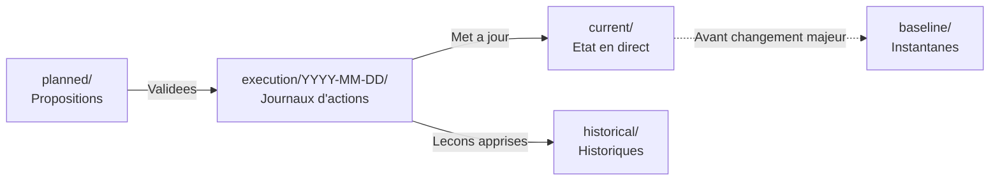

# Gestion de l'Etat — Villa Thaifa

> **Source unique de verite pour l'etat operationnel et la planification.**
> Aligne avec [`shared/standards/state-management.md`](../../../../shared/standards/state-management.md)

---

## Structure des Repertoires

| Repertoire     | Objectif                              | Mutabilite        | Fichiers         |
| -------------- | ------------------------------------- | ----------------- | ---------------- |
| `current/`     | Etat operationnel en direct           | Mis a jour quotidiennement | reservations.md  |
| `planned/`     | Propositions en attente de validation | Modifiable        | pricing.md       |
| `baseline/`    | Instantanes avant changement          | **Immuable**      | (vide)           |
| `execution/`   | Journaux d'actions par date (YYYY-MM-DD) | **Ajout seul** | (vide)           |
| `historical/`  | Historiques des changements, decisions | **Ajout seul**   | (vide)           |

---

## Fichiers Actuels

### Etat en Direct
- [`current/reservations.md`](current/reservations.md) — Reservations actuelles, assignations, occupation (mis a jour quotidiennement)

### Changements Planifies
- [`planned/pricing.md`](planned/pricing.md) — Configuration tarifaire HotelRunner en attente des decisions premium d'Omar

---

## Ressources Associees

| Ressource | Emplacement | Objectif |
|-----------|-------------|----------|
| Donnees de reference des chambres | [`../configs/hotel/rooms.md`](../configs/hotel/rooms.md) | Inventaire des chambres, types, capacites |
| Etat des promotions | [`../promotions/`](../promotions/) | Promotions Booking.com (deja conforme a la gestion d'etat) |
| Regles de plateforme | [`../platform/rules.md`](../platform/rules.md) | Regles d'operation pour Booking.com et HotelRunner |

---

## Flux de Travail

---

## Conformite au Standard

Cette structure suit le standard de gestion d'etat de l'organisation El-Mountassir :
- **Separation des preoccupations** : Configuration vs etat vs planification
- **Tracabilite** : Tous les changements journalises dans execution/
- **Securite** : Instantanes de baseline avant les changements majeurs
- **Apprentissage** : historical/ capture les decisions et lecons

Voir : [`shared/standards/state-management.md`](../../../../shared/standards/state-management.md)

---

_Mis a jour : 2025-12-23_
