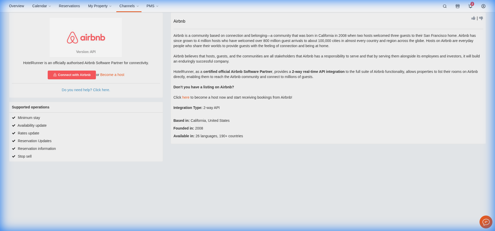
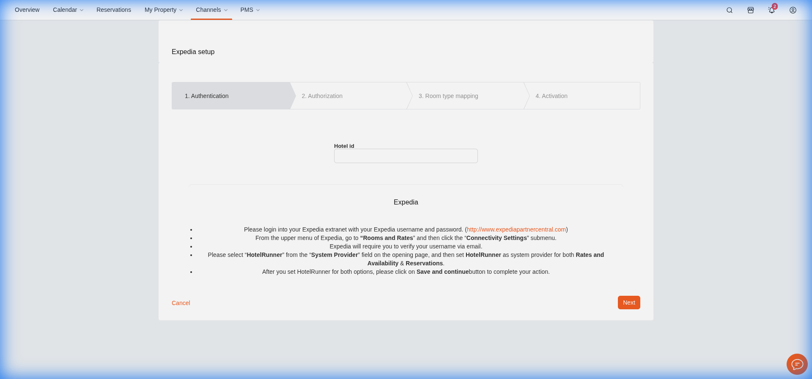
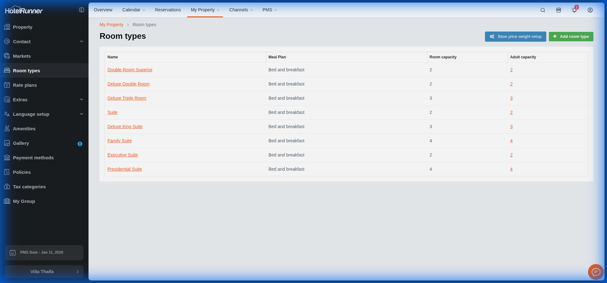

# 🏨 HotelRunner Knowledge Base

> **Dernière mise à jour**: 12 Janvier 2026
> **Statut**: Découverte en cours

## 🔐 Accès & Sécurité

- **URL Login**: `https://app.hotelrunner.com`
- **Mécanisme**: Email + Password.
- **Protection**:
  - **Google reCAPTCHA** (Images moto/bus etc.) actif à chaque tentative de login.
  - Empêche l'automatisation complète de la connexion.
- **Credentials PROD**:
  - Email Owner: [Voir .env.local]
  - Email Admin (Omar): [Pas encore actif]

## ⚠️ Contraintes

- L'IA ne peut pas passer le Captcha.
- **Solution**: L'utilisateur doit se connecter manuellement ou le Support HotelRunner doit configurer la liaison.

## 🔗 Connectivité OTAs

- **Status Actuel** (11/01/2026):
  - ✅ **Booking.com**: ACTIF.
  - ❌ **Expedia**: Non connecté.
  - ❌ **Airbnb**: Non connecté.

### Pré-requis Connexion (Découverts 12/01)

#### Airbnb

- **Type**: API / OAuth.
- **Action**: Cliquer sur "Connect". Nécessite d'être loggué au compte Airbnb Host.
- **Difficulté**: Faible (Juste login).
  

#### Expedia

- **Type**: Formulaire + Action Extranet.
- **Data Requise**: `Hotel ID`.
- **Action Extranet**: Aller sur Expedia Partner Central -> Connectivity Settings -> Autoriser "HotelRunner" pour Rates & Inventory.
- **Difficulté**: Moyenne (Nécessite coordination).
  

## 🛏️ Inventaire Chambres (Room Types)

Liste des 8 types de chambres configurés dans HotelRunner :

| Room Name                | Capacité |
| :----------------------- | :------- |
| **Double Room Superior** | 2        |
| **Deluxe Double Room**   | 2        |
| **Deluxe Triple Room**   | 3        |
| **Suite**                | 2        |
| **Deluxe King Suite**    | 3        |
| **Family Suite**         | 4        |
| **Executive Suite**      | 2        |
| **Presidential Suite**   | 4        |

