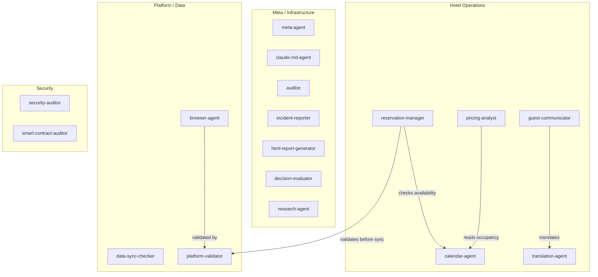

# Villa Thaifa — Agent Registry (17 Agents)

> Generated: 2026-02-09 | Source: `.claude/agents/*.md`

## Overview

17 specialized sub-agents organized in 4 domains. Each agent has a defined role, model tier, and tool set. The orchestrator (Kael) delegates to these agents — they never act autonomously.

## Agent Map

## Complete Registry

| #   | Agent                      | Domain                     | Model  | What It Does Concretely                                                                                                                                                  | Trigger                                                                          |
| --- | -------------------------- | -------------------------- | ------ | ------------------------------------------------------------------------------------------------------------------------------------------------------------------------ | -------------------------------------------------------------------------------- |
| 1   | **auditor**                | Meta / Audit               | Sonnet | Grades code, docs, and architecture on a S+/S/A/B/C/D/F scale ("Brutal Excellence Index"). Produces sin/violation/penance reports. Rejects anything below S-tier.        | After any deliverable needs quality validation                                   |
| 2   | **browser-agent**          | Platform / Automation      | Sonnet | Controls Chrome via MCP (navigate, click, fill forms, screenshot). Scrapes HotelRunner and Booking.com. Captures evidence screenshots before/after actions.              | Any web interface interaction (pricing update, reservation entry, data scraping) |
| 3   | **html-report-generator**  | Meta / Reporting           | Opus   | Transforms markdown/structured data into single-file HTML reports with dark/light themes, interactive checkboxes, collapsible sections, print CSS.                       | When a human-readable visual report is needed                                    |
| 4   | **incident-reporter**      | Meta / Documentation       | Haiku  | Creates timestamped incident files (`docs/incidents/open/`) when errors or failures occur. Classifies severity (Critical/Major/Minor/Info). Deduplicates.                | Proactively on any error, failure, or unexpected behavior                        |
| 5   | **decision-evaluator**     | Meta / Analysis            | Opus   | Multi-criteria decision analysis. Defines options, weights criteria, researches best practices via web, scores each option, produces weighted recommendation.            | When comparing 2+ approaches and need structured decision                        |
| 6   | **claude-md-agent**        | Meta / Governance          | Opus   | Maintains and optimizes `CLAUDE.md`. Researches Anthropic best practices first, enforces 1000-line limit, makes minimal targeted edits.                                  | When project instructions need updating                                          |
| 7   | **calendar-agent**         | Operations / Occupancy     | Sonnet | Analyzes room availability across all 12 rooms. Reads reservations from SSOT, builds availability matrix, detects gaps, flags double-bookings, calculates occupancy %.   | Checking availability, identifying gaps, detecting conflicts                     |
| 8   | **data-sync-checker**      | Operations / Sync          | Sonnet | Compares local SSOT vs HotelRunner/Booking.com exports. Detects discrepancies by field (dates, room, guest, status, price). Flags severity. Never executes sync.         | Before any sync operation or when data drift suspected                           |
| 9   | **research-agent**         | Meta / Research            | Haiku  | Web research for LOW criticality topics (general docs, best practices, comparisons). Searches, fetches, cross-references, synthesizes with sources.                      | General research needs (not security/config/architecture)                        |
| 10  | **translation-agent**      | Operations / Translation   | Haiku  | Translates guest communications between French, English, and Arabic. Preserves tone, flags untranslatable idioms, adds cultural notes for Moroccan context.              | Any multilingual communication need                                              |
| 11  | **smart-contract-auditor** | Security / Blockchain      | Opus   | Audits smart contracts for vulnerabilities (reentrancy, access control, integer overflow). Uses Slither/Mythril patterns. Produces severity-classified audit reports.    | Smart contract security review                                                   |
| 12  | **platform-validator**     | Platform / Validation      | Sonnet | Gatekeeper before ANY platform operation. Validates room exists, dates logical, price exact (not calculated), confidence >= 94%. Blocks execution on any failure.        | Before any HotelRunner/Booking.com submission                                    |
| 13  | **pricing-analyst**        | Operations / Revenue       | Opus   | Analyzes occupancy + competitor rates + Marrakech seasonality. Produces rate recommendations with % changes and justifications. Never modifies prices directly.          | Pricing strategy review or rate optimization                                     |
| 14  | **security-auditor**       | Security / AppSec          | Opus   | Reviews code for OWASP Top 10, implements auth (JWT, OAuth2), configures CORS/CSP, validates inputs. Produces audit reports + secure code + test cases.                  | Security reviews, auth flows, vulnerability fixes                                |
| 15  | **reservation-manager**    | Operations / Reservations  | Sonnet | Full reservation lifecycle: create, modify, cancel. Updates SSOT, checks availability via calendar-agent, validates via platform-validator, prepares platform sync data. | Any reservation operation                                                        |
| 16  | **guest-communicator**     | Operations / Communication | Sonnet | Drafts welcome messages, check-in/check-out instructions, response templates. Formal-warm tone, French default, aligned with luxury positioning (9.3/10 rating).         | Creating or reviewing guest-facing messages                                      |
| 17  | **meta-agent**             | Meta / Generation          | Opus   | Creates new sub-agents from descriptions. Reads standards library, selects model/color/tools, generates config file, updates registry. The agent that builds agents.     | When a new specialized agent is needed                                           |

## Dependencies

| Agent               | Depends On         | Why                                    |
| ------------------- | ------------------ | -------------------------------------- |
| reservation-manager | calendar-agent     | Availability checks before booking     |
| reservation-manager | platform-validator | Data validation before platform sync   |
| pricing-analyst     | calendar-agent     | Occupancy data for rate analysis       |
| guest-communicator  | translation-agent  | Multilingual message drafting          |
| browser-agent       | platform-validator | Validation before executing operations |

## Model Distribution

| Model                      | Count | Agents                                                                                                                            |
| -------------------------- | ----- | --------------------------------------------------------------------------------------------------------------------------------- |
| **Opus** (heavy reasoning) | 6     | html-report-generator, decision-evaluator, claude-md-agent, smart-contract-auditor, pricing-analyst, security-auditor, meta-agent |
| **Sonnet** (balanced)      | 7     | auditor, browser-agent, calendar-agent, data-sync-checker, platform-validator, reservation-manager, guest-communicator            |
| **Haiku** (fast/cheap)     | 3     | incident-reporter, research-agent, translation-agent                                                                              |

## Domain Distribution

| Domain                    | Count | Purpose                                                                        |
| ------------------------- | ----- | ------------------------------------------------------------------------------ |
| **Meta / Infrastructure** | 7     | Audit, reporting, research, governance, decisions, incidents, agent generation |
| **Hotel Operations**      | 5     | Calendar, reservations, pricing, guest comms, translation                      |
| **Platform / Data**       | 3     | Browser automation, data sync validation, input validation                     |
| **Security**              | 2     | Application security (OWASP) + smart contract security                         |
