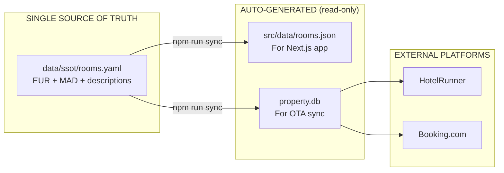
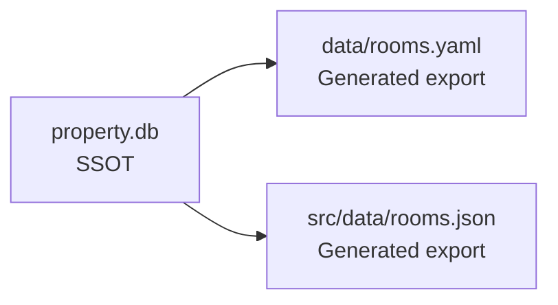

# Architecture Proposal — Villa Thaifa Single Source of Truth

**Created**: 2026-01-30
**Linear Issue**: [EM-191](https://linear.app/el-mountassir/issue/EM-191)

---

## Requirements

### Functional Requirements
1. **Dual Currency Support** — Store both EUR and MAD values (owner requirement)
2. **Single Source of Truth** — One place for room data
3. **OTA Compatibility** — Support HotelRunner, Booking.com, Expedia schemas
4. **Human-Readable** — Easy to edit/verify by non-technical staff
5. **Agent-Friendly** — Clear schema for AI agents to query

### Non-Functional Requirements
1. **No Data Loss** — All existing data preserved
2. **Progressive Migration** — No big-bang rewrites
3. **Backward Compatible** — Existing code keeps working during transition

---

## Proposed Architecture

### Option A: YAML SSOT + Generated Outputs (Recommended)



**Benefits**:
- Human-editable YAML as source
- Generated files are disposable
- Clear data flow
- Single place to update

### Option B: SQLite SSOT + YAML Export



**Benefits**:
- Relational integrity
- Query capability
- Existing OTA schema

**Drawbacks**:
- Less human-friendly
- Requires tooling to edit

---

## Recommended: Option A (YAML SSOT)

### New SSOT Schema

```yaml
# data/ssot/rooms.yaml
_meta:
  version: "2.0"
  last_updated: "2026-01-30"
  conversion_rate:
    eur_to_mad: 10.72  # CORRECT RATE (researched 2026-01-30)
    source: "XE.com - verify weekly"
    last_verified: "2026-01-30"

rooms:
  - id: "01"
    internal_id: "R01"  # For SQLite compatibility

    # Names
    name_en: "Deluxe Triple Room"
    name_fr: "Triple Deluxe"
    description_en: "..."
    description_fr: "Chambre 1 triple de luxe..."

    # Capacity
    capacity:
      adults: 3
      max_occupancy: 3

    # Beds (detailed)
    beds:
      - type: "king"
        count: 1
      - type: "sofa_bed"
        count: 1

    # Pricing (DUAL CURRENCY)
    pricing:
      base_rate_eur: 169
      base_rate_mad: 1812  # = 169 × 10.72
      currency_primary: "EUR"

    # Features
    features:
      view: "garden"
      floor: "ground"
      terrace_m2: null
      pool_access: false
      amenities: []

    # OTA Mapping
    ota:
      expedia_type: "Deluxe Triple Room"
      booking_type: "deluxe_triple"
      hotelrunner_id: null

    # Status
    status:
      verification: "verified"
      last_verified: "2026-01-24"

    # Media
    images:
      - path: "/photos/01/main.jpg"
        is_primary: true
```

### Key Design Decisions

| Decision | Choice | Rationale |
|----------|--------|-----------|
| Format | YAML | Human-readable, comments allowed |
| Currency | Store BOTH EUR + MAD | Owner requirement |
| Conversion | Explicit rate in `_meta` | Auditable, changeable |
| ID | Keep both `id` and `internal_id` | Backward compatible |
| Descriptions | Include in SSOT | Eliminates rooms.json duplication |
| OTA mapping | Dedicated section | Extensible for new platforms |

---

## Directory Structure (After Migration)

```
ssot/                        # ← SSOT AT PROJECT ROOT (prominent)
├── rooms.yaml               # Room data (EUR + MAD) ✅ CREATED
├── facilities.yaml          # Facility data (when ready)
└── _schema.yaml             # Schema documentation

data/
├── core/
│   └── inventory.yaml       # ← DEPRECATED → archive
│
└── generated/               # ← NEW: Auto-generated (gitignored)
    ├── rooms.json           # For Next.js
    └── rooms-mad.json       # MAD-only export if needed

src/data/
├── rooms.json              # ← DEPRECATED → replaced by ssot/

property.db                 # ← KEEP: Sync from SSOT
```

---

## Sync Script Design

```bash
# npm run sync:rooms
# 1. Reads data/ssot/rooms.yaml
# 2. Validates schema
# 3. Generates:
#    - data/generated/rooms.json (EUR)
#    - data/generated/rooms-mad.json (MAD)
#    - Updates property.db tables
# 4. Reports any conversion rate warnings
```

---

## Conversion Rate Strategy

```yaml
# In data/ssot/rooms.yaml _meta section
conversion_rate:
  eur_to_mad: 10.72
  source: "XE.com"
  last_verified: "2026-01-30"
  update_cadence: "weekly"
  auto_update: false  # Future: could use Frankfurter MCP
```

**Rules**:
1. MAD values stored explicitly (not computed on-the-fly)
2. Sync script warns if `base_rate_mad ≠ base_rate_eur × rate`
3. Manual override allowed (for rounded pricing)

---

## Migration Path

See [CONSOLIDATION-PLAN.md](./CONSOLIDATION-PLAN.md) for step-by-step migration.

---

## Resolved Questions

1. ~~**Conversion rate 11.0**~~ → **ANSWERED**: Correct rate is **10.72** (XE.com, Jan 2026)
2. ~~**Rate updates**~~ → **ANSWERED**: Weekly verification recommended
3. **Price rounding** — Should MAD prices be exact (1812) or rounded (1800)?

## Impact: Existing MAD Prices Need Correction

The current DB uses rate 11.0, but correct rate is 10.72. All MAD prices are **~2.6% inflated**.

See `~/grid/memory/knowledge/patterns/currency-handling.md` for full correction table.
