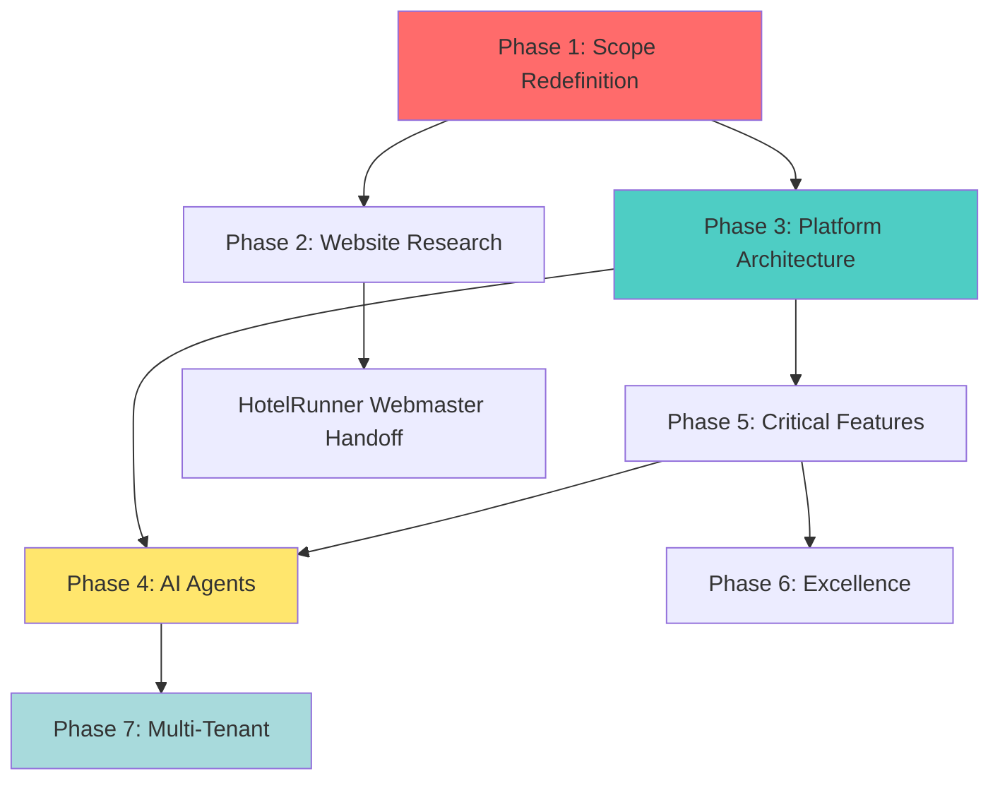
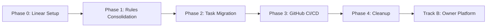

# 🏡 VILLA THAIFA → WORKSPACE EXCELLENCE + OWNER PLATFORM

## Dual-Track Transformation Plan

**Track A**: Workspace Standardization (Digital Chaos → Digital Excellence)
**Track B**: Owner Business Platform (Website → AI-powered Management)

**Strategic Vision**: Build professional agent infrastructure FIRST, then execute product features with rigor.

---

## 🎯 IMMEDIATE PRIORITY: WORKSPACE EXCELLENCE (Track A)

### Why This First?
Omar's directive: "On court à la catastrophe si on continue à travailler comme des bêtes préhistoriques!"

The workspace chaos (93 directories, 3 task systems, no verification) BLOCKS all quality work.

### Integrated Tooling Decision

| Tool | Purpose | Integration |
|------|---------|-------------|
| **Linear** | Project Management | Primary task tracking, roadmap, sprints |
| **GitHub Issues** | Code-related tickets | Bugs, PRs, technical debt |
| **Linear ↔ GitHub** | Auto-sync | Close Issues when PRs merge |

### Hybrid Approach (MCP + Code Execution)
- **Simple ops** (create issue, read status) → MCP tools
- **Complex workflows** (reports, bulk updates) → Code execution
- **Token savings**: 93% vs all-MCP approach

---

## 🔄 STATUS UPDATE (2026-01-30 - Latest)

> **Last Updated**: 2026-01-30 by Claude Code CLI (17:50 UTC)
> **Session**: Phase 1 + Phase 2 Complete (Rules + Linear Migration)

### 📊 TRACK A PROGRESS SUMMARY

| Phase | Status | Notes |
|-------|--------|-------|
| **Phase 0: Foundations** | ✅ **COMPLETE** | Linear MCP + .secrets/ access + knowledge persistence |
| **Phase 1: Rules Consolidation** | ✅ **COMPLETE** | All 4 rules created (.agents/rules/), AGENTS.md refactored (2026-01-30) |
| **Phase 2: Linear Integration** | ✅ **COMPLETE** | 29 issues migrated + audited (92 pts), standard template, ~/grid/ updated (2026-01-30) |
| **Phase 3: GitHub Integration** | 🔴 NOT STARTED | Templates + CI/CD needed |
| **Phase 4: Great Consolidation** | 🔴 NOT STARTED | Legacy cleanup pending |
| **Phase 5: Verification** | 🔴 NOT STARTED | Testing infrastructure needed |

### 📊 TRACK B PROGRESS SUMMARY

| Phase | Status | Notes |
|-------|--------|-------|
| **Phase 1: Scope** | 🔴 NOT STARTED | PRD-001 needed |
| **Phase 2: Website Research** | 🔴 NOT STARTED | Competitive analysis |
| **Phase 3: Architecture** | 🟢 PARTIAL | SQLite exists, tRPC needed |
| **Phase 4: AI Agents** | 🔴 NOT STARTED | Revenue Manager first |
| **Phase 5: Features** | 🟢 PARTIAL | Room mgmt exists |
| **Phase 6: Excellence** | 🔴 NOT STARTED | Testing + perf |
| **Phase 7: Multi-Tenant** | 🔴 NOT STARTED | Future |

---

### Research Findings (Key Patterns)

### Research Findings (Key Patterns)

**From Anthropic Engineering Blog:**

1. **Code Execution with MCP** (98% token savings)
   - Present MCP servers as filesystem APIs (`servers/hotelrunner/getReservations.ts`)
   - On-demand discovery instead of upfront loading
   - Local data processing before sending to model

2. **Advanced Tool Use** (85% token reduction)
   - Tool Search Tool for dynamic discovery
   - Programmatic Tool Calling for multi-step workflows
   - Tool Examples for complex APIs

3. **Long-Running Agents** (Session Discipline)
   - Two-Agent Architecture: Initializer (once) + Coding Agent (repeating)
   - Feature List JSON with "failing" status initially
   - Session Startup Protocol: verify → review → select → check → work → commit → document

**Linear Integration Status:** ✅ COMPLETE (2026-01-30)
- MCP: ✅ Installed with Bearer token (`claude mcp add --transport http linear`)
- Connection: ✅ Verified (`linear: ✓ Connected`)
- Skill: ✅ `/linear` skill available
- Authentication: ✅ Bearer token (no OAuth needed)

**Hybrid Approach Recommendation:**
```
Simple ops (create issue) → MCP (reliable, low token)
Complex ops (reports)    → Code Execution (78-98% savings)
Time-sensitive          → Direct API (bypass MCP overhead)
```

---

## 📐 WORKSPACE EXCELLENCE PHASES (Track A)

### Phase 0: Foundations (Immediate - Day 1)

**0.1 Conditional .secrets/ Access + Linear MCP Setup**

**Context**: Linear OAuth has known reconnection bugs (GitHub #10250). Solution: Bearer token authentication with conditional .secrets/ access pattern.

**Security Research**: 3 agents analyzed Claude Code CLI security, AI coding assistant risks, and MCP security. Key findings:
- Claude Code reads .env files automatically (CRITICAL risk)
- Deny rules are 70-80% reliable (not 100%)
- Linear MCP uses OAuth 2.1 (credentials stay on Linear's servers, NOT Anthropic)
- LINEAR_API_KEY = LOW risk (scoped tokens, isolated)
- Solution: Template-only pattern (agents manage .env.example, Chairman manages .env)

**Implementation Steps**:

**Step 1: Modify CLAUDE.md (Conditional Access)**
- Update Rule #2 from blanket FORBIDDEN to CONDITIONAL
- Allow: Read/Write `.secrets/.env.example` (templates)
- Forbid: Read/Write `.secrets/.env` (real credentials)
- Update Directory Permissions table (line 35)
- Add new Key Files entries

**Step 2: Add Hook-Based Access Control**
- File: `~/grid/config/claude/settings.json`
- Add 4 PreToolUse hooks:
  - Block Read/Write/Edit on `.secrets/.env` (hard block, exit 2)
  - Warn on any `.env` file access (except .env.example)
- Test: Agent tries to read `.secrets/.env` → BLOCKED
- Test: Agent reads `.secrets/.env.example` → ALLOWED

**Step 3: Enhance .secrets/.env.example**
- Add agent instructions (✅ can/❌ cannot)
- Add rotation policy (90 days)
- Enhance Linear section with:
  - Where to get key (https://linear.app/settings/api)
  - Required scopes (read, write, issues:create)
  - MCP setup command
  - Placeholder: `lin_api_xxxxxxxxxxxxxxxxxxxx`

**Step 4: Create Documentation Files**
- `memory/knowledge/operations/credential-rotation.md` (rotation log)
- `memory/knowledge/operations/credential-management-protocol.md` (template-only protocol)
- Update `memory/knowledge/integrations/linear-guide.md` (Bearer token setup)

**Step 5: Configure Linear MCP (Chairman-Only)**
```bash
# 1. Get Linear API Key from https://linear.app/settings/api
# 2. Store in .secrets/.env
echo 'LINEAR_API_KEY="lin_api_your_real_key_here"' >> ~/grid/.secrets/.env
source ~/grid/.secrets/.env

# 3. Remove old OAuth config
claude mcp remove linear --scope user

# 4. Add with Bearer token
claude mcp add \
  --scope user \
  --transport http \
  linear \
  https://mcp.linear.app/mcp \
  --header "Authorization: Bearer ${LINEAR_API_KEY}"

# 5. Verify connection
claude mcp list
# Expected: linear: ✓ Connected

# 6. Test skill
/linear "list my issues"
```

**Step 6: Security Controls**
- Create pre-commit hook (block .env commits, scan API key patterns)
- Install: `chmod +x ~/grid/.git/hooks/pre-commit`
- Verify .gitignore excludes `.secrets/.env`

**Step 7: Verification**
- ✅ Agent cannot read `.secrets/.env`
- ✅ Agent can read `.secrets/.env.example`
- ✅ Linear MCP connects
- ✅ `/linear` skill works
- ✅ Real .env never committed
- ✅ Pre-commit hook blocks secrets

**Critical Files**:
- `~/grid/CLAUDE.md` (Rule #2 + Directory Permissions)
- `~/grid/config/claude/settings.json` (PreToolUse hooks)
- `~/grid/.secrets/.env.example` (enhanced template)
- `~/grid/.git/hooks/pre-commit` (secret scanning)
- `~/grid/memory/knowledge/operations/credential-rotation.md` (new)
- `~/grid/memory/knowledge/operations/credential-management-protocol.md` (new)

**0.2 Knowledge Persistence for Future Instances** ✅ COMPLETE (2026-01-30)
- [x] Create `memory/knowledge/integrations/linear-guide.md`
- [x] Create `memory/knowledge/patterns/long-running-agents.md`
- [x] Create `memory/knowledge/patterns/mcp-code-execution.md`
- [x] Update CLAUDE.md to reference these at session start (Rule #8)

**0.3 Session Startup Protocol** ✅ COMPLETE (2026-01-30)
- [x] Added to CLAUDE.md as Rule #8 (14-step checklist)

### Phase 1: Agent & Rules Consolidation (Day 2-3) ✅ COMPLETE

**1.1 Centralize Rules (`.agents/rules/`)** ✅
- [x] `.agents/rules/workspace.md` (Artifacts, Paths)
- [x] `.agents/rules/git.md` (Branching, Commits)
- [x] `.agents/rules/verification.md` (Testing, Evidence)
- [x] `.agents/rules/linear-workflow.md` (Issue lifecycle)

**Evidence**: All 4 files created (commit ab9192b)

**1.2 Refactor AGENTS.md as Index** ✅
- [x] Keep only: Manifest, References, Active Context
- [x] Move rules to `.agents/rules/`
- [x] Index agents: Gemini, Claude (with links)

**Evidence**: AGENTS.md reduced from 382 to 183 lines (commit ab9192b)

**1.3 Unify Agent Configs** 🟡 PARTIAL
- [ ] Merge shared rules from CLAUDE.md/GEMINI.md into AGENTS.md
- [x] Agent index created in AGENTS.md (Claude, Gemini capabilities)

**Note**: Rule unification deferred - AGENTS.md now references `.agents/rules/` as canonical source

### Phase 2: Linear Integration (Day 3-5)

**2.1 Migrate Tasks to Linear**
- [ ] Scan `tasks/`, `workstream/`, `.agents/input/jobs/`
- [ ] Create Linear Issues for each valid item
- [ ] Archive old task files to `.agents/artifacts/archive/`

**2.2 Linear ↔ GitHub Sync**
- [ ] Configure auto-close when PRs merge
- [ ] Rule: No code without Linear Issue ID

**2.3 Director Workflow**
1. **Ideation**: Omar adds idea to Linear Inbox
2. **Refinement**: Agent converts to PRD/Spec
3. **Approval**: Omar reviews plan
4. **Execution**: Agents execute with GitHub transparency
5. **Review**: Omar validates deployment

### Phase 3: GitHub Integration (Day 5-7)

**3.1 Templates**
- [ ] `.github/ISSUE_TEMPLATE/bug-report.md`
- [ ] `.github/ISSUE_TEMPLATE/feature-request.md`
- [ ] `.github/PULL_REQUEST_TEMPLATE.md`

**3.2 CI/CD**
- [ ] `.github/workflows/ci.yml` (Lint, Typecheck, Test)
- [ ] Branch protection: Require CI pass

### Phase 4: The Great Consolidation (Day 7-10)

**4.1 Archive Legacy**
- [ ] Move `legacy/`, `archive/`, `content/` → `.agents/artifacts/archive/`
- [ ] Delete `tasks/`, `workstream/` (after Linear migration)

**4.2 Documentation Restructure**
- `docs/architecture/` (ADRs, RFCs)
- `docs/business/` (Mission, Roadmap, PRDs)
- `docs/manuals/` (User Guides, Operations)

### Phase 5: Verification & Testing (Ongoing)

**5.1 Testing Infrastructure**
- [ ] Configure Vitest for unit tests
- [ ] Configure Playwright for E2E
- [ ] Target: 80% coverage

**5.2 Definition of Done**
1. Linear Issue moved to Review
2. PR open with passing CI
3. Evidence attached (screenshot, test output)
4. Documentation updated

---

## 🏗️ OWNER PLATFORM PHASES (Track B - After Track A)

> **Agent**: Claude Code CLI
> **Date**: 2026-01-29
> **Previous Session**: Gemini/Antigravity unified agent workspace

### ✅ Completed Since Plan Creation

| Task | Agent | Date | Evidence |
|------|-------|------|----------|
| Unified agent workspace | Gemini | 2026-01-29 | `.agents/` created |
| Merge `develop` → `main` | Gemini | 2026-01-29 | +14,578 lines recovered |
| SQLite database operational | Gemini | 2026-01-29 | 12 rooms verified |
| Admin dashboard | Gemini | 2026-01-29 | `/admin/rooms` functional |
| Room detail editor | Gemini | 2026-01-29 | Screenshots in `.agents/artifacts/` |
| Git branching strategy | Gemini | 2026-01-29 | AGENTS.md updated |
| Plan migration | Gemini | 2026-01-29 | `comprehensive-transformation-plan.md` |
| Project migration to grid | Claude | 2026-01-28 | `~/grid/clients/villa-thaifa/` |

### 📁 Plans Transferred from `~/.claude/plans/`

| Plan | Size | Status | Action |
|------|------|--------|--------|
| `iterative-jumping-sun.md` | 30KB | ✅ Migrated | → `.agents/plans/comprehensive-transformation-plan.md` |
| `goofy-tumbling-sky.md` | 4.3KB | ✅ Completed | Migration finished, archive as historical |
| `federated-petting-sonnet.md` | 6.4KB | N/A | Grid-level (not Villa Thaifa specific) |
| `whimsical-questing-wadler.md` | 12KB | N/A | Grid-level (not Villa Thaifa specific) |

### 🎯 Updated Current State

**What EXISTS now** (post-Gemini work):
- ✅ Next.js app with homepage (12 rooms)
- ✅ **SQLite database** with rooms, beds, amenities tables
- ✅ **Admin dashboard** (`/admin/rooms`) - functional grid view
- ✅ **Room editor** (`/admin/rooms/[id]`) - detail editing
- ✅ HotelRunner integration (browser automation)
- ✅ Unified agent workspace (`.agents/`)
- ✅ Git branching strategy for multi-agent work

**What's STILL missing**:
- ❌ tRPC backend (planned)
- ❌ Authentication (NextAuth.js planned)
- ❌ Reservations system
- ❌ Financial reporting
- ❌ AI agent workforce
- ❌ Guest CRM

### 📊 Adjusted Phase Status

| Phase | Original Timeline | Adjusted Status |
|-------|-------------------|-----------------|
| Phase 1: Scope | Week 1-2 | 🟡 Pending - PRD still needed |
| Phase 2: Website Research | Week 2-3 | 🟡 Pending |
| Phase 3: Architecture | Week 3-5 | 🟢 **Partially Complete** (DB exists) |
| Phase 4: AI Agents | Week 6-12 | 🔴 Not Started |
| Phase 5: Features | Week 5-16 | 🟢 **Partially Complete** (Room mgmt exists) |
| Phase 6: Excellence | Ongoing | 🔴 Not Started |
| Phase 7: Multi-Tenant | Month 4-6 | 🔴 Not Started |

---

## 📊 EXECUTIVE SUMMARY

### Current State (Updated 2026-01-29)

- Next.js app with homepage (12 rooms) + **functional admin dashboard**
- **SQLite database operational** with 12 verified rooms
- HotelRunner integration (manual browser automation, functional)
- **Room management exists** (list + detail editor)
- Missing: tRPC backend, auth, reservations, AI agents
- Said (78, owner) needs reduced operational burden
- Omar targeting 80% automation by June 2026

### Strategic Context

- **Villa Thaifa = Pilot Client** for Morocco small property platform
- **HotelRunner** handles OTA distribution (150+ channels)
- **Our Platform** = Business intelligence + operations + AI agents
- **Market Opportunity**: 1,500+ riads in Marrakech alone, HotelRunner has CNT partnership

### Success Criteria (June 2026)

- ✅ 80% automation of routine tasks
- ✅ Omar operational time < 20% (from 100%)
- ✅ 9.5+ guest satisfaction maintained
- ✅ 10%+ direct booking revenue (reduce OTA dependence)
- ✅ Platform ready for 2nd property onboarding

---

## 🎯 PHASE 1: PROJECT SCOPE REDEFINITION (Week 1-2)

### 1.1 Create Product Requirements Document (PRD)

**File**: `docs/project/specs/requirements/PRD-001-owner-platform.md`

**Contents**:

```markdown
# Vision

Morocco's first AI-powered property management platform for boutique hospitality

# Target Personas

1. Property Owner (Said) - Strategic oversight, financial reporting
2. Property Manager - Day-to-day operations, staff coordination
3. Revenue Manager - Pricing, promotions, yield management
4. Finance Manager - P&L, commissions, tax reporting

# Core Problems Solved

- No centralized dashboard for multi-OTA performance
- Manual financial tracking (commission reconciliation impossible)
- No guest CRM or upsell opportunities
- No revenue optimization intelligence
- 25% effective Booking.com commission (industry standard 15%)

# Platform Boundaries

## What HotelRunner Webmaster Handles:

- Client-facing website design and build
- Direct booking engine implementation
- Public content (room descriptions, photos, SEO)
- Marketing site optimization

## What We Build:

- Owner dashboard (analytics, financial reporting)
- Guest CRM (pre/post-stay communication, preferences)
- AI agent workforce (revenue, operations, finance, maintenance)
- Trust accounting and owner statements
- Platform integrations (HotelRunner, Booking.com, Airbnb)
- Mobile-first manager interface
- Multi-tenant architecture (scale to other properties)

# Success Metrics

- 80% automation by June 2026
- <20% Omar operational time
- 9.5+ guest satisfaction
- Reduce avg OTA commission from 25% to 18%
- 10%+ direct booking revenue by Q3 2026
```

**Action**: Create PRD with full sections (vision, personas, requirements, metrics)

### 1.2 Update Stakeholder Documentation

**File**: `docs/leadership/STAKEHOLDERS.md`

**Add Section**:

```markdown
## Platform Roles & Responsibilities

### HotelRunner Webmaster (External Partner)

- **Scope**: Client-facing website
- **Deliverables**:
  - Website design based on our research/wireframes
  - Direct booking engine
  - SEO and marketing site
- **Timeline**: To be confirmed with HotelRunner
- **Coordination**: Omar provides design specs, content

### El Mountassir Platform Team (Internal)

- **Scope**: Owner business intelligence platform
- **Deliverables**:
  - Owner dashboard (analytics, finance, operations)
  - AI agent workforce (5 agents, phased rollout)
  - Guest CRM and automation
  - Multi-property expansion capability
- **Timeline**: 16-week roadmap (see below)
```

**Action**: Update STAKEHOLDERS.md with clear role separation

### 1.3 Create Architecture Decision Record

**File**: `docs/architecture/ADR-003-platform-positioning.md`

**Key Decisions**:

1. **Platform-first architecture** (multi-tenant from day one)
2. **API-first design** (client site consumes same APIs as owner dashboard)
3. **Data sovereignty** (owner owns data, can export/migrate)
4. **Progressive enhancement** (works without AI, AI adds intelligence)

**Action**: Document strategic positioning ADR

---

## 🌐 PHASE 2: CLIENT WEBSITE RESEARCH & HANDOFF (Week 2-3)

### 2.1 Competitive Website Research

**File**: `docs/branding/competitive-website-analysis.md`

**Research Protocol**:

1. Identify 10 best luxury villa/riad websites (Morocco + international)
2. For each site capture:
   - URL + screenshots (hero, rooms, booking flow)
   - Design patterns (typography, color, layout)
   - Booking UX flow
   - Mobile responsiveness
   - Performance (Lighthouse score)

**Target Sites**:

- **Morocco**: Riad 72, Villa Maroc, Villa Mabrouka, Riad Jardin Secret
- **International**: Ministry of Villas, The Thinking Traveller, Oliver's Travels
- **Airbnb Luxury Collection** (UX benchmark)

**Tool**: Use `agent-browser` for systematic extraction

**Action**: Create comprehensive analysis with screenshots and pattern extraction

### 2.2 Design Specifications Package

**Location**: `docs/branding/website-design-specs/`

**Structure**:

```
website-design-specs/
├── design-system.md          # Colors, typography, spacing, components
├── wireframes/
│   ├── homepage.png
│   ├── rooms-gallery.png
│   ├── room-detail.png
│   ├── booking-flow.png
│   └── mobile-nav.png
├── components/
│   ├── hero-section.md       # Hero specs
│   ├── room-card.md          # Room grid card
│   ├── booking-widget.md     # Booking engine integration
│   └── footer.md             # Footer with trust signals
└── brand-assets/
    ├── logo-usage.md
    ├── photography-guidelines.md
    └── tone-of-voice.md
```

**Design System Recommendations**:

```css
/* Moroccan Luxury Palette */
--primary: #8b7355; /* Warm taupe (Moroccan earth) */
--accent: #c19a6b; /* Desert gold */
--dark: #2c2416; /* Deep brown */
--light: #f5f1ed; /* Warm white */
--success: #6b8e4e; /* Olive green (palms) */

/* Typography */
--heading: "Cormorant Garamond", serif; /* Luxury */
--body: "Inter", sans-serif; /* Readability */
```

**Action**: Create design package for HotelRunner webmaster

### 2.3 Handoff Coordination

**File**: `docs/operations/hotelrunner-webmaster-handoff.md`

**Deliverables to HotelRunner**:

- [ ] Competitive analysis (10 sites)
- [ ] Design specifications (wireframes, design system)
- [ ] Brand assets (logo, photos, copy)
- [ ] Content structure (room descriptions, amenities, policies)
- [ ] Technical requirements (API endpoints for booking engine)

**Timeline**: Coordinate with Said and HotelRunner contact

**Action**: Create handoff checklist and schedule coordination meeting

---

## 🏗️ PHASE 3: PLATFORM ARCHITECTURE (Week 3-5)

### 3.1 Backend Framework Selection

**File**: `docs/architecture/ADR-004-backend-framework.md`

**Decision**: **tRPC + Next.js App Router**

**Rationale**:

- End-to-end type safety (schema changes propagate automatically)
- Already using Next.js (zero additional infra)
- Perfect for owner dashboard (low-latency requirements)
- Zod integration (already using for validation)
- Easy to extract to separate service later

**Implementation Structure**:

```
src/
├── server/
│   ├── trpc/
│   │   ├── routers/
│   │   │   ├── rooms.ts
│   │   │   ├── reservations.ts
│   │   │   ├── analytics.ts
│   │   │   ├── finance.ts
│   │   │   └── guests.ts
│   │   ├── context.ts
│   │   └── index.ts
│   └── db/
│       ├── schema/
│       ├── migrations/
│       └── seed.ts
├── app/
│   ├── api/trpc/[trpc]/route.ts
│   └── (owner)/
└── lib/
    └── trpc-client.ts
```

**Action**: Document framework decision with pros/cons analysis

### 3.2 Database Strategy

**File**: `docs/architecture/ADR-005-database-strategy.md`

**Migration Path**: SQLite → PostgreSQL

**Phase 1 (Development)**: SQLite (better-sqlite3, already installed)
**Phase 2 (Production)**: PostgreSQL via Supabase (free tier: 500MB, 50K MAU)

**ORM Decision**: **None (Plain SQL + Zod)**

- Better performance
- Full SQL control for complex analytics
- Type safety via Zod schemas
- Easier debugging

**Schema Expansion**:

```sql
-- New tables for owner platform
CREATE TABLE reservations (
    id TEXT PRIMARY KEY,
    room_id TEXT NOT NULL,
    guest_name TEXT,
    check_in DATE NOT NULL,
    check_out DATE NOT NULL,
    source TEXT NOT NULL, -- 'booking.com', 'airbnb', 'direct'
    status TEXT NOT NULL, -- 'confirmed', 'checked_in', 'completed'
    total_amount REAL,
    commission_rate REAL,
    commission_amount REAL,
    currency TEXT DEFAULT 'EUR',
    FOREIGN KEY(room_id) REFERENCES rooms(id)
);

CREATE TABLE guests (
    id TEXT PRIMARY KEY,
    email TEXT UNIQUE,
    name TEXT NOT NULL,
    phone TEXT,
    nationality TEXT,
    language_preference TEXT,
    dietary_restrictions TEXT,
    total_stays INTEGER DEFAULT 0,
    lifetime_value REAL,
    satisfaction_score REAL
);

CREATE TABLE financial_transactions (
    id TEXT PRIMARY KEY,
    reservation_id TEXT NOT NULL,
    transaction_date DATE,
    transaction_type TEXT, -- 'booking', 'commission', 'refund'
    amount REAL,
    currency TEXT DEFAULT 'EUR',
    FOREIGN KEY(reservation_id) REFERENCES reservations(id)
);
```

**Action**: Create migration scripts and seed data

### 3.3 Authentication & Authorization

**File**: `docs/architecture/ADR-006-authentication.md`

**Solution**: NextAuth.js (Auth.js) with role-based access

**Roles**:

```typescript
enum UserRole {
  OWNER = "owner", // Said - Full access
  ADMIN = "admin", // Omar - Full operational access
  MANAGER = "manager", // Operations only
  FINANCE = "finance", // Read-only analytics
  READONLY = "readonly", // Auditor
}
```

**Initial Users**:

- `said_thaifa@hotmail.fr` (OWNER, villa-thaifa)
- `omar@el-mountassir.com` (ADMIN, villa-thaifa + future properties)

**Action**: Implement auth with NextAuth.js + seed initial users

---

## 🤖 PHASE 4: AI AGENT WORKFORCE (Week 6-12)

### 4.1 Agent Implementation Priority (By ROI)

**File**: `docs/architecture/ai-agents-roadmap.md`

#### Agent 1: Revenue Manager (Week 6-7) — P0

**Capabilities**:

- Monitor competitor pricing (3-5 nearby properties)
- Analyze booking patterns and demand signals
- Recommend dynamic pricing adjustments
- Detect promotion opportunities
- Alert on pricing errors

**Data Requirements**:

- HotelRunner reservation data (12 months historical)
- Booking.com competitor pricing (web scraping)
- Seasonal patterns, local events calendar
- Current occupancy and forward bookings

**Expected ROI**: 7-10% RevPAR increase = €15,000-25,000 annually

**Technical Approach**:

```typescript
// src/agents/revenue-manager/index.ts
import { Anthropic } from "@anthropic-ai/sdk";
import { StateGraph } from "@langchain/langgraph";

export class RevenueManagerAgent {
  async analyzePricing(context: PricingContext) {
    // 1. Fetch competitor prices
    // 2. Analyze demand signals
    // 3. Generate recommendations
    // 4. Validate recommendations
    // 5. Send to Omar for approval
  }
}
```

**Integration**: Daily scheduled run (6 AM) → Email/Slack to Omar

#### Agent 2: Financial Director (Week 8-9) — P1

**Capabilities**:

- Generate monthly owner P&L statements
- Reconcile commission charges across OTAs
- Track payment status (pending, received, disputes)
- Calculate tax obligations (Morocco VAT, tourist tax)
- Forecast cash flow (next 3 months)

**Output Formats**:

- PDF owner statements (monthly)
- Excel financial dashboards
- Email alerts for payment issues
- Tax filing preparation

**Expected ROI**: 200+ hours saved annually, 100% commission accuracy

#### Agent 3: Operations Manager (Week 10) — P2

**Capabilities**:

- Daily staff briefings (check-ins, check-outs, special requests)
- Housekeeping schedules
- Maintenance issue tracking
- Airport transfers coordination
- Guest arrival instructions

**Integration**: WhatsApp Business API for staff communication

**Expected ROI**: 12% labor cost reduction without service degradation

#### Agent 4: Guest Relations (Week 11) — P2

**Capabilities**:

- Pre-arrival welcome messages (personalized)
- Upsell spa/dining/excursions
- Post-stay thank you and review requests
- Complaint handling with empathy
- Guest preference profiles

**Communication Channels**: Email, WhatsApp, SMS

**Expected ROI**: 5-8% increase in upsell revenue, improved reviews

#### Agent 5: Maintenance Coordinator (Week 12) — P3

**Capabilities**:

- Preventive maintenance schedules
- Repair request prioritization
- Automatic supply ordering
- Maintenance reports
- Safety alerts

**Expected ROI**: Prevent €3K-10K emergency repairs annually

### 4.2 AI Agent Framework

**File**: `docs/architecture/ADR-007-ai-agent-framework.md`

**Framework**: LangGraph + Claude API

**Rationale**:

- LangGraph: State management for multi-step workflows
- Claude API: Best reasoning for financial/operational decisions
- Tool use: Native integration with HotelRunner, database

**Action**: Implement base agent class and Revenue Manager first

---

## 🎯 PHASE 5: CRITICAL FEATURES (Week 5-16)

### 5.1 Room Management (Week 5-6)

**UI Screens**:

```
/owner/rooms
├── /list                    # Grid view
├── /[id]/edit               # Edit details
├── /[id]/pricing            # Pricing calendar
├── /[id]/photos             # Photo manager
└── /[id]/availability       # Availability calendar
```

**Features**:

- CRUD operations
- Pricing management (base rates, seasonal adjustments)
- Photo upload and management
- Amenity configuration

### 5.2 Reservation System (Week 7-8)

**Features**:

- HotelRunner sync (pull reservations every 6 hours)
- Manual reservation entry (direct bookings, phone)
- Guest data capture
- Status tracking (confirmed → checked-in → completed)
- Modification/cancellation handling

**Sync Strategy**:

```typescript
// Scheduled job every 6 hours
export async function syncReservations() {
  const latest = await hotelRunnerAPI.getReservations({
    modifiedSince: getLastSyncTime(),
  });

  for (const reservation of latest) {
    await db.upsertReservation({
      externalId: reservation.id,
      source: "hotelrunner",
      ...mapFields(reservation),
    });
  }
}
```

### 5.3 Financial Reporting (Week 9-10)

**Owner Dashboard Widgets**:

1. Revenue Overview (MTD vs last month/year)
2. Occupancy Rate (MTD, YTD, forecast)
3. Channel Performance (revenue by OTA)
4. Commission Analysis (total paid, average rate)
5. Top Performing Rooms
6. Cash Flow Projection (90 days)

**Reports**:

- Monthly Owner Statement (PDF)
- P&L by Channel
- Commission Reconciliation
- Tax Summary (Morocco VAT, tourist tax)

### 5.4 Calendar Management (Week 11)

**Features**:

- Visual calendar (month/week/day views)
- Drag-and-drop reservations
- Availability blocking
- Rate calendar
- Occupancy heatmap

**Integration**: Bidirectional sync with HotelRunner

### 5.5 Platform Integration Dashboard (Week 12)

**Monitoring**:

- HotelRunner connection health
- Channel status (Booking.com, Airbnb, Expedia)
- Sync logs and errors
- Manual sync trigger

### 5.6 Guest CRM (Week 13-14)

**Guest Profile**:

```typescript
interface GuestProfile {
  id: string;
  name: string;
  email: string;

  // Preferences
  dietaryRestrictions: string[];
  roomPreferences: string[];

  // History
  totalStays: number;
  lifetimeValue: number;
  averageRating: number;

  // Marketing
  emailSubscribed: boolean;
  marketingTags: string[]; // 'vip', 'repeat'
}
```

**Communication Automation**:

- Booking confirmation (immediate)
- Pre-arrival instructions (3 days before)
- Upsell offers (spa, transfer)
- Check-in reminder (1 day before)
- Thank you message (day after checkout)
- Review request (3 days after)

---

## 📋 PHASE 6: REMAINING WORK & EXCELLENCE

### 6.1 Homepage Styling Improvements

**File**: `workstream/backlog/homepage-ux-improvements.md`

**Current Issues** (from analysis):

- Basic/unpolished design (inline CSS)
- No hover effects or interactions
- Missing modern UI patterns
- Typography needs refinement

**Improvements**:

1. **Extract styles to CSS modules** (eliminate inline styles)
2. **Implement design system** (colors, typography, spacing)
3. **Add interactions** (hover effects, smooth scrolling)
4. **Optimize images** (Next.js Image component, WebP format)
5. **SEO improvements** (meta tags, structured data, Open Graph)
6. **Performance** (code splitting, lazy loading)
7. **Accessibility** (ARIA labels, keyboard navigation, color contrast)

**Note**: This will be handed off to HotelRunner webmaster with design specs, but we should complete improvements for reference implementation.

### 6.2 Testing Infrastructure (Ongoing)

**Coverage Target**: 80% minimum

**Test Pyramid**:

- Unit Tests (60%): Business logic, transformations, utilities
- Integration Tests (30%): tRPC procedures, database operations
- E2E Tests (10%): Critical user flows (login, create reservation, generate report)

**Stack**:

- Vitest (unit/integration)
- Playwright (E2E)
- Testing Library (React components)

**TDD Workflow**: Write test (RED) → Implement (GREEN) → Refactor (IMPROVE)

### 6.3 Security Hardening

**Pre-Commit Checklist**:

- [ ] No hardcoded secrets
- [ ] All inputs validated (Zod schemas)
- [ ] SQL injection prevention (parameterized queries)
- [ ] XSS prevention (sanitized HTML)
- [ ] CSRF protection (NextAuth default)
- [ ] Authentication verified
- [ ] Authorization checked (role-based)
- [ ] Rate limiting on endpoints
- [ ] Error messages sanitized

### 6.4 Performance Optimization

**Metrics**:

- FCP < 1.8s
- LCP < 2.5s
- TTI < 3.5s
- CLS < 0.1
- API p95 < 200ms

**Techniques**:

- Image optimization (Next.js Image)
- Code splitting (dynamic imports)
- Database indexing
- Caching (React Query)
- Edge rendering

### 6.5 Monitoring & Observability

**Tools**:

- Sentry (error tracking)
- Vercel Analytics (performance)
- Posthog (user analytics, optional)

**Alerts**:

- HotelRunner sync failures
- Payment processing errors
- High error rates (>1% over 5 min)

---

## 🚀 PHASE 7: MARKET EXPANSION (Month 4-6)

### 7.1 Multi-Tenant Architecture

**File**: `docs/architecture/ADR-008-multi-tenancy.md`

**Database Schema Updates**:

```sql
CREATE TABLE properties (
    id TEXT PRIMARY KEY,
    name TEXT NOT NULL,
    slug TEXT UNIQUE,
    owner_id TEXT NOT NULL,
    property_type TEXT, -- 'villa', 'riad', 'hotel'
    room_count INTEGER,
    FOREIGN KEY(owner_id) REFERENCES users(id)
);

-- Add property_id to all tables
ALTER TABLE rooms ADD COLUMN property_id TEXT REFERENCES properties(id);
ALTER TABLE reservations ADD COLUMN property_id TEXT;
```

**Data Isolation**: Row-level security (RLS) in PostgreSQL

**URL Structure**:

```
owner.villathaifa.com/dashboard         # Multi-property
owner.villathaifa.com/villa-thaifa      # Specific property
owner.villathaifa.com/riad-example      # Future property
```

### 7.2 SaaS Pricing Model

**Tiers**:

- Solo (1-5 rooms): €49/month
- Boutique (6-15 rooms): €99/month
- Premium (16-30 rooms): €199/month
- Enterprise (30+): Custom

**Revenue Model**:

- Monthly subscription
- Commission on direct bookings (1-2%)
- Premium AI agents: +€50/month per agent
- Setup fee: €500 one-time

### 7.3 Managed Service Packages

**Package 1: Platform Only** (€99/month)

- Owner dashboard
- Financial reporting
- HotelRunner sync
- Self-service support

**Package 2: Platform + Basic Management** (€299/month)

- Everything in Package 1
- Weekly revenue reviews
- Monthly owner meetings
- Email support

**Package 3: Full Managed Service** (€799/month + 5% revenue)

- Everything in Package 2
- AI agents fully managed
- Daily operations monitoring
- Priority phone support
- Channel manager optimization

### 7.4 Morocco Market Strategy

**Target**: 1,500+ riads/villas in Morocco

**Acquisition Channels**:

1. HotelRunner Partnership (CNT registry access)
2. Booking.com Partner Network
3. Morocco Tourism Board (official partner)
4. LinkedIn/Facebook Ads (property owners)

**Localization**:

- French/Arabic UI
- Morocco tax regulations built-in
- Dirham (MAD) support
- Local payment gateways (CMI, Maroc Telecommerce)

**Competitive Advantages**:

1. AI-powered revenue management (unique in market)
2. Morocco-specific compliance
3. Multi-language support
4. Trust accounting (owner transparency)
5. Mobile-first design

---

## 📂 DOCUMENTATION & ROUTING

### Critical Routing Updates

**Every new file MUST be routed**:

**When creating in `docs/architecture/`**:

- Update `AGENTS.md` architecture section
- Add to `docs/architecture/INDEX.md` (create if needed)

**When creating in `docs/operations/`**:

- Update operations index

**When creating in `src/agents/`**:

- Update `AGENTS.md` AI agents section

**When creating in `workstream/`**:

- Update workstream index

### Session Summaries

**Location**: `memory/sessions/YYYY-MM-DD-session-name.md`

**After each significant session**:

```markdown
# Session Summary: YYYY-MM-DD

## Objectives

- [What was planned]

## Completed

- [Deliverables]

## Decisions

- [Key architectural/product decisions]

## Blockers

- [Issues and resolutions]

## Handoff

- [Next session focus]
```

### Architecture Decision Records

**Required ADRs**:

- [x] ADR-001: Tech Stack (completed)
- [x] ADR-002: Database Schema (completed)
- [ ] ADR-003: Platform Positioning (Phase 1)
- [ ] ADR-004: Backend Framework (Phase 3)
- [ ] ADR-005: Database Strategy (Phase 3)
- [ ] ADR-006: Authentication (Phase 3)
- [ ] ADR-007: AI Agent Framework (Phase 4)
- [ ] ADR-008: Multi-Tenancy (Phase 7)

---

## 🎯 DEPENDENCY GRAPH & CRITICAL PATH



### Critical Path (MVP)

**Week 1-2**: Phase 1 (Scope) → **BLOCKER** for all work
**Week 3-5**: Phase 3 (Architecture) → **BLOCKER** for features/AI
**Week 5-10**: Phase 5.1-5.3 (Core Features) → **BLOCKER** for AI
**Week 6-12**: Phase 4 (AI Agents) → **BLOCKER** for 80% automation

### Risk Mitigation

| Risk                   | Impact | Mitigation                           |
| ---------------------- | ------ | ------------------------------------ |
| HotelRunner API limits | High   | Maintain browser automation fallback |
| Said unavailable       | Medium | Async documentation review           |
| AI accuracy <90%       | High   | Human-in-loop for critical decisions |
| Database migration     | Medium | Gradual SQLite → PostgreSQL          |
| Omar time constraints  | High   | Agents automate first, manual backup |

---

## ✅ VERIFICATION & SUCCESS CRITERIA

### Phase 1 Complete When:

- [ ] PRD-001 approved by Omar
- [ ] STAKEHOLDERS.md updated with role separation
- [ ] Said understands platform value (owner dashboard)
- [ ] HotelRunner webmaster coordination scheduled

### Phase 3 Complete When:

- [ ] tRPC backend running with test endpoint
- [ ] Database schema migrated (rooms, reservations, guests)
- [ ] Authentication working (Omar + Said can log in)
- [ ] First API endpoint tested (`GET /api/trpc/rooms.getAll`)

### Phase 4 Complete When:

- [ ] Revenue Manager agent running daily
- [ ] Financial Director generating monthly reports
- [ ] Agent recommendations accuracy >90%

### Phase 5 Complete When:

- [ ] Owner views all reservations (HotelRunner synced)
- [ ] Monthly financial report generates correctly
- [ ] Guest CRM captures preferences from 10+ guests

### Overall Success (June 2026):

- [ ] 80% automation (Omar time <20%)
- [ ] 9.5+ guest satisfaction
- [ ] 10%+ direct booking revenue
- [ ] Said reports reduced stress
- [ ] Platform ready for 2nd property

---

## 🚀 IMMEDIATE NEXT STEPS (Updated 2026-01-30)

### ⚠️ CRITICAL PATH: Track A First, Then Track B



### ~~Day 1 Actions (Phase 0)~~ ✅ COMPLETE

**All Phase 0 items completed on 2026-01-30:**
- ✅ Linear MCP with Bearer token (not OAuth)
- ✅ Knowledge persistence files created
- ✅ Session Startup Protocol in CLAUDE.md (Rule #8)
- ✅ Conditional .secrets/ access (Rule #2)
- ✅ PreToolUse hooks for .env protection
- ✅ founder.md enhanced with vision/philosophy

### Day 2-3 Actions (Phase 1)

**P1 - CREATE RULES**

```
.agents/rules/
├── workspace.md      # Artifact paths, directory structure
├── git.md            # Branching, commits, PR workflow
├── verification.md   # Testing, evidence, Definition of Done
└── linear-workflow.md # Issue lifecycle, labels, sprints
```

**P1 - REFACTOR AGENTS.MD**

Convert to index format:
- Remove inline rules → link to `.agents/rules/`
- Keep: Manifest, References, Tools
- Index agents with capabilities

### Day 3-5 Actions (Phase 2)

**P1 - MIGRATE TO LINEAR**

1. Create Linear workspace "Villa Thaifa"
2. Scan and convert:
   - `tasks/active.md` → Linear Issues
   - `workstream/backlog/` → Linear Backlog
   - `.agents/input/jobs/` → Linear Issues
3. Archive migrated files

### Day 5-7 Actions (Phase 3)

**P2 - GITHUB INTEGRATION**

1. Create `.github/ISSUE_TEMPLATE/`
2. Create `.github/PULL_REQUEST_TEMPLATE.md`
3. Create `.github/workflows/ci.yml`
4. Enable branch protection

### Week 2+ (Track B Begins)

**After Track A Complete:**

| Priority | Task | Depends On |
|----------|------|------------|
| P1 | PRD-001 Owner Platform | Track A complete |
| P1 | tRPC layer on SQLite | PRD approved |
| P1 | NextAuth.js authentication | tRPC ready |
| P2 | Reservations system | Auth ready |
| P2 | Revenue Manager Agent | Reservations ready |

### Critical Path (Revised)

```
[BLOCKING] Track A: Workspace Excellence
    └─→ Phase 0: Linear (Day 1)
    └─→ Phase 1: Rules (Day 2-3)
    └─→ Phase 2: Migration (Day 3-5)
    └─→ Phase 3: GitHub (Day 5-7)

[BLOCKED BY Track A] Track B: Owner Platform
    └─→ PRD → tRPC → Auth → Features → AI Agents
```

### Files to Create (This Session)

| Location | File | Priority |
|----------|------|----------|
| `~/grid/memory/knowledge/integrations/` | `linear-guide.md` | P0 |
| `~/grid/memory/knowledge/patterns/` | `long-running-agents.md` | P0 |
| `~/grid/memory/knowledge/patterns/` | `mcp-code-execution.md` | P0 |
| `.agents/rules/` | `workspace.md` | P1 |
| `.agents/rules/` | `git.md` | P1 |
| `.agents/rules/` | `verification.md` | P1 |
| `.github/ISSUE_TEMPLATE/` | `bug-report.md` | P2 |
| `.github/workflows/` | `ci.yml` | P2 |

---

## 📝 CRITICAL FILES FOR IMPLEMENTATION

These files are **essential** for successful execution:

### 1. Product Requirements Document

**Path**: `docs/project/requirements/PRD-001-owner-platform.md`
**Why**: Defines entire platform vision, scope boundaries, success criteria. North star for all decisions.

### 2. Backend Framework ADR

**Path**: `docs/architecture/ADR-004-backend-framework.md`
**Why**: Technical foundation (tRPC + Next.js). All API development depends on this.

### 3. tRPC Router Implementation

**Path**: `src/server/trpc/routers/_app.ts`
**Why**: Core API file. All business logic (analytics, finance, AI agents) flows through here.

### 4. Revenue Manager Agent

**Path**: `src/agents/revenue-manager/index.ts`
**Why**: First and highest-ROI AI agent. Demonstrates unique value proposition.

### 5. Multi-Tenancy ADR

**Path**: `docs/architecture/ADR-008-multi-tenancy.md`
**Why**: Expansion strategy. Getting this right prevents costly refactoring.

### 6. Competitive Website Analysis

**Path**: `docs/branding/competitive-website-analysis.md`
**Why**: Design foundation for HotelRunner webmaster handoff.

### 7. AI Agents Roadmap

**Path**: `docs/architecture/ai-agents-roadmap.md`
**Why**: Implementation sequence, ROI justification, technical approach for all 5 agents.

---

## 🎉 GAME-CHANGING DIFFERENTIATORS

**What Makes This Platform Unique**:

1. **AI-First Architecture** (Not AI-as-feature)
   - 5 autonomous agents working 24/7
   - Revenue optimization that competitors can't match
   - Operations automation reducing labor costs 12%

2. **Morocco-Specific** (Not generic PMS)
   - Built-in tax compliance (Morocco VAT, tourist tax)
   - Local payment gateways (CMI, Maroc Telecommerce)
   - Multi-language (French, Arabic, English, Dutch)
   - HotelRunner partnership (CNT access)

3. **Trust Accounting** (Transparency)
   - Owner sees exact commission breakdown
   - Payment tracking across all OTAs
   - Monthly professional statements (not spreadsheets)

4. **Scale-Ready from Day 1**
   - Multi-tenant architecture
   - API-first design
   - White-label potential
   - Managed service packages

5. **Mobile-First** (Manager on-the-go)
   - Property managers approve from anywhere
   - Real-time notifications (WhatsApp integration)
   - Offline-capable PWA

---

## 📚 REFERENCE MATERIALS

### Research Sources (URLs)

**Luxury Villa Websites**:

- Ministry of Villas Morocco: https://www.ministryofvillas.com/villa/morocco/
- Riad 72 Marrakech: https://www.riad72.com/
- Villa Maroc: https://villa-maroc.com/
- Villa Mabrouka: https://villamabrouka.com/
- Airbnb Luxury Morocco: https://www.airbnb.com/morocco/stays/luxury

**Market Research**:

- HotelRunner Morocco Expansion: https://hotelrunner.com/en/news/partnerships/
- AI in Hotel Revenue 2026: https://hoteltechnologynews.com/2025/11/
- PMS Comparison (Guesty, Hostaway, Lodgify): https://www.guesty.com/blog/guesty-vs-hostaway-vs-lodgify/

### Internal Documentation

**Project Context**:

- `BRIEFING-COMPLET-29-JANVIER-2026.md` (current P0-P3 tasks)
- `docs/leadership/VISION.md` (Omar's vision, success metrics)
- `docs/leadership/STAKEHOLDERS.md` (roles, decision hierarchy)

**Architecture**:

- `docs/architecture/tech-stack-decision.md` (to be created)
- `src/db/schema.sql` (existing database schema)
- `AGENTS.md` (capabilities routing)

**Operations**:

- `docs/operations/.env.rules.md` (credentials handling)
- `docs/operations/CREDENTIALS.md` (platform accounts)
- `sources/hotelrunner-api/STATUS-FINAL.md` (integration status)

---

## 🎯 EXECUTION PHILOSOPHY

**From Omar's Vision**:

> "La transformation agentique n'est pas une option, c'est une nécessité."

**Our Approach**:

1. **Plan the future, then build it** (not the reverse)
2. **Excellence over speed** (80% test coverage, security-first)
3. **AI as co-workers** (not tools - autonomous agents)
4. **Data-driven decisions** (every recommendation backed by analysis)
5. **Multi-tenant from day 1** (scale-ready architecture)

**Success = Villa Thaifa thriving + platform ready to transform Morocco's boutique hospitality sector**

---

**END OF PLAN**

This roadmap transforms Villa Thaifa from a client website into Morocco's first AI-powered owner business platform, positioning for market dominance across 1,500+ boutique properties.
