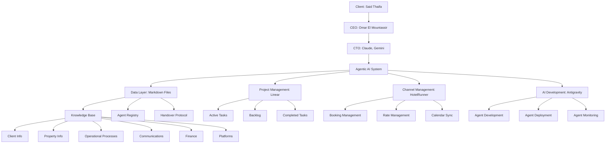

# Stack

## Architecture

### Agentic AI System

```mermaid
graph TD
    A[Client: Said Thaifa] --> B[CEO: Omar El Mountassir]
    B --> C[CTO: Claude, Gemini]
    C --> D[Agentic AI System]

    D --> E[Data Layer: Markdown Files]
    D --> F[Project Management: Linear]
    D --> G[Channel Management: HotelRunner]
    D --> H[AI Development: Antigravity]

    E --> I[Knowledge Base]
    E --> J[Agent Registry]
    E --> K[Handover Protocol]

    F --> L[Active Tasks]
    F --> M[Backlog]
    F --> N[Completed Tasks]

    G --> O[Booking Management]
    G --> P[Rate Management]
    G --> Q[Calendar Sync]

    H --> R[Agent Development]
    H --> S[Agent Deployment]
    H --> T[Agent Monitoring]

    I --> U[Client Info]
    I --> V[Property Info]
    I --> W[Operational Processes]
    I --> X[Communications]
    I --> Y[Finance]
    I --> Z[Platforms]
```

## Tech Stack

- Markdown (Data)
- Linear (Project Management)
- HotelRunner (Channel Manager)
- Antigravity (AI Agent / Agentic IDE)
