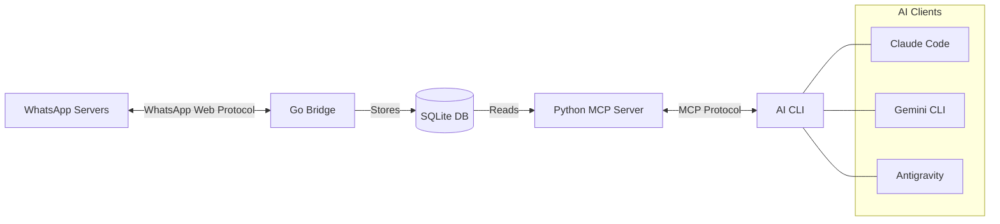

# WhatsApp MCP Server — Setup Guide

> **Source**: [lharries/whatsapp-mcp](https://github.com/lharries/whatsapp-mcp)
> **Purpose**: Read/search/send WhatsApp messages via MCP protocol
> **Status**: Installation in Progress (Bridge Running)
> **Created**: 2026-02-09
> **Targets**: Claude Code CLI, Gemini CLI, Antigravity

## What It Does

MCP server connecting your personal WhatsApp account to AI CLIs.

| Tool              | Description                           |
| ----------------- | ------------------------------------- |
| Contact search    | Find contacts by name                 |
| Message retrieval | Read messages with filters            |
| Chat listing      | List and retrieve chats               |
| Message context   | Get surrounding messages              |
| Send text         | Send messages to individuals/groups   |
| Send media        | Send images, videos, documents, audio |
| Download media    | Download attachments from messages    |

**Architecture**: Go bridge (WhatsApp Web <-> SQLite) + Python MCP server (SQLite <-> AI CLI).



## Prerequisites Check

| Dependency      | Required         | Status        | Path                                |
| --------------- | ---------------- | ------------- | ----------------------------------- |
| Go              | Yes              | 1.25.6        | `/home/linuxbrew/.linuxbrew/bin/go` |
| UV              | Yes              | 0.9.28        | `/home/director/.local/bin/uv`      |
| Python 3.6+     | Yes (via UV)     | Managed by UV | Auto-resolved                       |
| FFmpeg          | Optional (audio) | 6.1.1         | `/usr/bin/ffmpeg`                   |
| Claude Code CLI | Target           | Installed     | `~/.claude/settings.json`           |
| Gemini CLI      | Target           | **Installed** | Ready for integration               |

## Security Advisory

> **Prompt Injection Risk**: The authors note this project is "subject to the lethal trifecta" — prompt injection could expose private message data. WhatsApp messages become accessible to the AI model when tools are invoked.

**Mitigations**:

- Data stored locally in SQLite only (no cloud sync)
- Messages only shared when you explicitly invoke WhatsApp tools
- QR code auth expires ~20 days (re-scan required)

---

## Installation Steps

### Step 1: Clone Repository

```bash
# Location: infrastructure/integrations/ (external system integration)
mkdir -p ~/el-mountassir/infrastructure/integrations/whatsapp-mcp
cd ~/el-mountassir/infrastructure/integrations/
git clone https://github.com/lharries/whatsapp-mcp.git whatsapp-mcp-repo
```

**Expected path**: `~/el-mountassir/infrastructure/integrations/whatsapp-mcp-repo/`

### Step 2: Start Go Bridge (First Run = QR Auth)

```bash
cd ~/el-mountassir/infrastructure/integrations/whatsapp-mcp-repo/whatsapp-bridge
go run main.go
```

- QR code displayed in terminal
- Open WhatsApp mobile -> Settings -> Linked Devices -> Link a Device
- Scan the QR code
- Bridge starts syncing messages to local SQLite

> The Go bridge must be running for the MCP server to access messages.

### Step 3: Configure AI CLIs

See per-CLI sections below.

---

## Configuration: Claude Code CLI

**Method**: `claude mcp add` (stdio transport, local process)

```bash
claude mcp add \
  --scope user \
  whatsapp \
  -- \
  /home/director/.local/bin/uv \
  --directory /home/director/el-mountassir/infrastructure/integrations/whatsapp-mcp-repo/whatsapp-mcp-server \
  run main.py
```

**Verification**:

```bash
claude mcp list          # Should show "whatsapp" server
claude mcp get whatsapp  # Show server details
```

**Alternative — settings.json** (add to `~/.claude/settings.json`):

```json
{
  "mcpServers": {
    "whatsapp": {
      "command": "/home/director/.local/bin/uv",
      "args": [
        "--directory",
        "/home/director/el-mountassir/infrastructure/integrations/whatsapp-mcp-repo/whatsapp-mcp-server",
        "run",
        "main.py"
      ]
    }
  }
}
```

---

## Configuration: Gemini CLI

Gemini CLI is installed. Add the following to `~/.gemini/settings.json`:

```json
{
  "mcpServers": {
    "whatsapp": {
      "command": "/home/director/.local/bin/uv",
      "args": [
        "--directory",
        "/home/director/el-mountassir/infrastructure/integrations/whatsapp-mcp-repo/whatsapp-mcp-server",
        "run",
        "main.py"
      ]
    }
  }
}
```

---

## Configuration: Antigravity (Project-Level Gemini)

Add to project `.gemini/settings.json` (e.g., in villa-thaifa):

```json
{
  "mcpServers": {
    "whatsapp": {
      "command": "/home/director/.local/bin/uv",
      "args": [
        "--directory",
        "/home/director/el-mountassir/infrastructure/integrations/whatsapp-mcp-repo/whatsapp-mcp-server",
        "run",
        "main.py"
      ]
    }
  }
}
```

---

## MCP Config Reference

Store a copy in the MCP configs registry:

**File**: `~/el-mountassir/infrastructure/configs/mcp/.mcp.json.whatsapp`

```json
{
  "whatsapp": {
    "command": "/home/director/.local/bin/uv",
    "args": [
      "--directory",
      "/home/director/el-mountassir/infrastructure/integrations/whatsapp-mcp-repo/whatsapp-mcp-server",
      "run",
      "main.py"
    ],
    "transport": "stdio",
    "auth": "none (Go bridge handles WhatsApp auth via QR code)",
    "notes": "Requires whatsapp-bridge Go process running"
  }
}
```

---

## Go Bridge Persistence

### Option A: tmux Session (Simple)

```bash
tmux new-session -d -s whatsapp-bridge \
  "cd ~/el-mountassir/infrastructure/integrations/whatsapp-mcp-repo/whatsapp-bridge && go run main.go"
```

### Option B: systemd User Service (Recommended)

Create `~/.config/systemd/user/whatsapp-bridge.service`:

```ini
[Unit]
Description=WhatsApp MCP Bridge
After=network-online.target

[Service]
Type=simple
WorkingDirectory=/home/director/el-mountassir/infrastructure/integrations/whatsapp-mcp-repo/whatsapp-bridge
ExecStart=/home/linuxbrew/.linuxbrew/bin/go run main.go
Restart=on-failure
RestartSec=10

[Install]
WantedBy=default.target
```

```bash
systemctl --user enable whatsapp-bridge
systemctl --user start whatsapp-bridge
```

### Option C: Pre-built Binary (Best Performance)

```bash
cd ~/el-mountassir/infrastructure/integrations/whatsapp-mcp-repo/whatsapp-bridge
go build -o whatsapp-bridge main.go
# Use binary path in systemd ExecStart instead of `go run`
```

---

## Re-Authentication

WhatsApp Web sessions expire ~20 days. When expired:

1. Stop Go bridge
2. Delete session database (check bridge docs for path)
3. Restart bridge
4. Scan new QR code

---

## Execution Checklist

- [x] Clone repo to `~/el-mountassir/infrastructure/integrations/whatsapp-mcp-repo/`
- [x] Run Go bridge and scan QR code (History Synced)
- [ ] Create MCP config at `infrastructure/configs/mcp/.mcp.json.whatsapp`
- [ ] Configure Claude Code CLI (`claude mcp add`)
- [ ] Verify Claude Code connection (`claude mcp list`)
- [x] Install Gemini CLI (prerequisite)
- [x] Configure Gemini CLI settings
- [x] Configure Antigravity project settings
- [ ] Set up Go bridge persistence (systemd or tmux)
- [ ] Test: search a contact from Claude Code
- [ ] Test: read a message from Claude Code

## References

- [whatsapp-mcp GitHub](https://github.com/lharries/whatsapp-mcp)
- [MCP Protocol Spec](https://spec.modelcontextprotocol.io)
- MCP configs registry: `~/el-mountassir/infrastructure/configs/mcp/`
- Infrastructure INDEX: `~/el-mountassir/infrastructure/INDEX.md`
