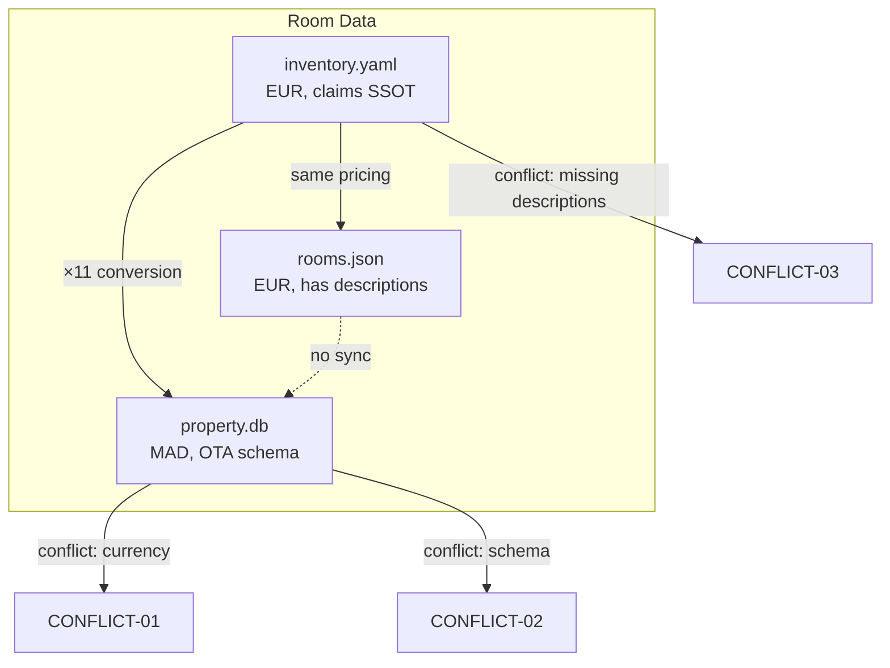

# Conflict Map — Villa Thaifa Codebase Audit

**Created**: 2026-01-30
**Linear Issue**: [EM-191](https://linear.app/el-mountassir/issue/EM-191)

---

## Critical Conflicts

### CONFLICT-01: Currency Mismatch (CRITICAL)

```
┌─────────────────────────────────────────────────────────────┐
│  YAML/JSON (EUR)          SQLite (MAD)                      │
│  ─────────────            ──────────                        │
│  Room 01: 169 EUR    ×11  → 1859 MAD                        │
│  Room 07: 329 EUR    ×11  → 3619 MAD                        │
│  Room 12: 449 EUR    ×11  → 4939 MAD                        │
└─────────────────────────────────────────────────────────────┘
```

**Impact**: Agents may use wrong currency, causing pricing errors on OTAs.

**Resolution**: EUR is operational (OTAs use EUR). SQLite MAD values are derived. **Keep EUR as SSOT**.

---

### CONFLICT-02: Schema Incompatibility (HIGH)

| Field | YAML/JSON | SQLite | Notes |
|-------|-----------|--------|-------|
| ID format | `"01"` | `"R01"` | Different prefix |
| Pricing field | `pricing.standard_rate` / `price.amount` | `base_rate_mad` | Different name, different currency |
| Type field | `type` | `expedia_type` / `internal_name` | Split into two fields |
| Floor | `features.floor` | `floor` | Nested vs flat |
| Capacity | `capacity.adults` | `occupancy_adults` | Nested vs flat |
| Beds | Array of strings | Separate `beds` table | Different structure |

**Impact**: Code must handle multiple schemas. Data sync is error-prone.

**Resolution**: Define canonical schema, migrate all sources.

---

### CONFLICT-03: Duplicate Room Data (MEDIUM)

```
┌─────────────────────────────────────────────────────────────┐
│  inventory.yaml    ←──?──→    rooms.json                    │
│  (claims SSOT)                (has descriptions)            │
└─────────────────────────────────────────────────────────────┘
```

| Aspect | inventory.yaml | rooms.json |
|--------|----------------|------------|
| Pricing | ✅ Identical | ✅ Identical |
| Features | ✅ Identical | ✅ Identical |
| Descriptions | ❌ Missing | ✅ Present |
| French names | ✅ `type_fr` | ❌ Missing |

**Impact**: Changes must be made in both places. Easy to drift.

**Resolution**: Merge into single file OR establish clear master/derived relationship.

---

### CONFLICT-04: Placeholder Data Treated as Real (LOW)

Files with all placeholder values:
- `src/data/facilities.json` — all "A confirmer"
- `docs/knowledge/finance/rates.json` — all "TODO"
- `docs/knowledge/property/VILLA_THAIFA.json` — mostly TODO

**Impact**: Agents may treat placeholder data as real data.

**Resolution**: Mark placeholder files clearly OR remove until populated.

---

## Conflict Dependency Graph



---

## Which Source is Authoritative?

| Data Type | Authoritative Source | Reason |
|-----------|---------------------|--------|
| Room pricing | `data/rooms/inventory.yaml` | Claims SSOT, EUR matches OTAs |
| Room descriptions | `src/data/rooms.json` | Only source with descriptions |
| OTA integration | `property.db` | Schema designed for Expedia/Booking |
| Facilities | NONE | All placeholder |
| Finance rates | NONE | All placeholder |

---

## Recommended Resolution Priority

| Priority | Conflict | Action |
|----------|----------|--------|
| P0 | CONFLICT-01 (Currency) | Document EUR as SSOT, deprecate or auto-derive MAD |
| P1 | CONFLICT-02 (Schema) | Design unified schema that supports all use cases |
| P2 | CONFLICT-03 (Duplicates) | Merge YAML descriptions from JSON, single SSOT |
| P3 | CONFLICT-04 (Placeholders) | Add `status: placeholder` field or remove |
